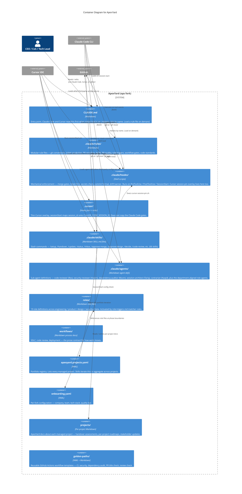

# Container Diagram — ApexYard

> **C4 Level 2** — the functional subsystems inside the ApexYard fork. Non-traditional: ApexYard has no runtime of its own. Each "container" is a folder-scoped set of files interpreted by an external system (Claude Code CLI, Cursor IDE, the user, or GitHub's rendering).

## Diagram

## How to read this

ApexYard is unusual in C4 terms: there is **no running process that IS ApexYard**. Every "container" above is a folder of files. The "runtime" is either:

- **Claude Code CLI** — reads `CLAUDE.md`, executes hooks, invokes skills, spawns sub-agents
- **Cursor IDE** — loads the same `.claude/` runtime when third-party configs are on. The `.cursor/` overlay only maps the session id.
- **The user** — reads role files, workflow docs, and the portfolio registry manually
- **GitHub** — renders Markdown in the repo view, enforces branch protection, runs CI on `golden-paths/` pipelines copied into project repos

The diagram captures which "container" does what *when interpreted by the right runtime*. It's a useful zoom level even though it diverges from the typical "containers are deployable units" framing of L2.

## Key relationships

- **CLAUDE.md → rules** is the single most important arrow. CLAUDE.md indexes every rule file by name. The agent Reads a named file when the work needs it. Hooks remain the mechanical gates. Without the index, rules are orphaned prose.
- **hooks → github** — hooks call `gh` directly (e.g. `block-merge-on-red-ci.sh` runs `gh pr checks`). This is how ApexYard's mechanical enforcement reaches the remote tracker state.
- **skills → github** — skills are the user-facing portfolio-aware commands. Most call `gh` at some point; some also read the registry to iterate.
- **skills → registry / projectdocs** — the portfolio-level read/write flow. `/inbox` / `/status` / `/projects` / `/stakeholder-update` all live here.

## What this diagram does NOT show

- Specific hook-to-rule mapping (which hook enforces which rule) — see `docs/rule-audit.md` for that.
- The full list of 66 skills — see CLAUDE.md § "Available skills".
- The full list of 19 roles — see `.claude/rules/role-triggers.md`.
- The user's local `workspace/<name>/` clones of managed projects — they're gitignored and sit outside the ApexYard boundary (they belong to the managed project, not to ApexYard).

## Related diagrams

- L1 system context: [`apexyard-context.md`](./apexyard-context.md)
- SDLC sequence (how a feature flows phase by phase): `workflows/sdlc.md`
- Rule audit (every MUST → hook / advisory / deferred): `docs/rule-audit.md`

## Maintenance

Updates when:

- A new top-level directory is added or removed (e.g. if `.claude/skills/` were renamed)
- A new "container" type joins the architecture (e.g. a `templates/` folder were promoted to first-class)
- The Claude Code integration model changes (new event type, new agent shape)

Skill-count / hook-count / role-count drift goes in the relevant summary docs (CLAUDE.md, hooks/README.md), not here. This diagram stays at the "shape of the fork" level.

## Evolution

**2026-09-16 — native-first Cursor overlay (AgDR-0151, me2resh/apexyard#1311).** Cursor.app 3.10.20 executed unmodified `.claude/hooks/*.sh` through the Claude Code loader. The generated 86-entry `hooks.json` copy became a lock-the-session hazard (`failClosed` plus leftover user config). Architecture change: Cursor is now a runtime of `.claude/`, not a second gate list. `.cursor/` is a one-hook overlay that maps `session_id` onto `CLAUDE_CODE_SESSION_ID`. Skill count on this diagram moved from 31 to 66 to match CLAUDE.md.

**2026-09-16 — Bash PreToolUse dispatcher (AgDR-0157, me2resh/apexyard#1317).** Claude Code Bash `PreToolUse` no longer fans out one process per gate. `.claude/settings.json` registers one dispatcher. `.claude/hooks/dispatch-bash.sh` runs the existing hook scripts by command prefix. Policy still lives in those scripts. pi and opencode derive the same routes from the dispatcher table. They do not exec the dispatcher as a nested gate.

Unconditional safety hooks now always run before command-specific gates. The first blocking reason can change when two gates would both exit 2. If command parse fails, the dispatcher still runs the merge gates so a missing `jq` cannot skip T13. The C4 containers stay the same. The change is inside the hooks container.

**2026-09-17 — SessionStart dispatcher (AgDR-0159, me2resh/apexyard#1318).** SessionStart no longer fans out one process per hook. `.claude/settings.json` registers one dispatcher. `.claude/hooks/dispatch-session-start.sh` runs `pin-ops-root.sh` first. It then runs the remaining SessionStart scripts concurrently. Policy still lives in those scripts.

The C4 containers stay the same. The change is inside the hooks container.

**2026-09-17 — Token-efficiency Wave 2 (AgDR-0160, me2resh/apexyard#1319).** CLAUDE.md is an index. It no longer auto-imports every rule body. Agents Read a named file under `.claude/rules/` when the work needs it. Hard gates stay in the hooks container. AGENTS.md stays a short operator bridge. The Claude Code baseline on `dev` `3953d50` was about 43.1k tokens (15 `@` imports, not a 22-file glob). The Wave 2 test caps the CLAUDE.md catalogue at 9,000 tokens and AGENTS.md at 5,000 tokens.

The C4 containers stay the same. The CLAUDE.md → rules arrow is now index-plus-on-demand, not glob import.

**2026-09-17 — /update chain backfill for v5.6.0–v5.6.2 (me2resh/apexyard#1298).** Three releases shipped with no pair script. `migration_chain` refused at v5.5.2 and returned empty. The C4 containers stay the same. The change is three no-op placeholders under `.claude/migrations/`, so `/update` can walk v5.4.0 → v5.6.2 again. The `/release` missing-script check stays advisory, per #1105.

**2026-09-17 — Rex body validation before marker write (AgDR-0161, me2resh/apexyard#1322).** The Output Format was instruction-only. A posted review could omit required headings and still write a SHA marker. `_lib-review-markers.sh` now validates the local body, requires a `**APPROVED**` verdict line, and requires a matching footer SHA before the write. The merge gate still reads only the SHA. The hooks container stays the gate.

**2026-09-18 — Tracker adapter stderr pass-through (me2resh/apexyard#1332).** `tracker_create` already forwarded CLI stderr after #1327. `tracker_view`, `tracker_list`, and `tracker_review_submit` now do the same for gh, glab, and custom adapters. Custom templates must not enable verbose HTTP tracing. Merge-SHA lookups still swallow stderr. The hooks container stays the gate.

**2026-09-18 — Adapter-test yq guard (me2resh/apexyard#1328).** `test_manage_portfolio_adapters.sh` exited 1 when yq was absent. The manager script still requires yq. The test now reports PASS and exits 0 when yq is missing. It does not print SKIP. `bin/run-hook-tests.sh` treats a SKIP line as a failed suite. CI still runs the real cases because CI has yq. The C4 containers stay the same.

**2026-09-18 — Dispatch merge gates inside command wrappers (AgDR-0162, me2resh/apexyard#1338).** The Bash dispatcher matched merge commands by prefix. `/approve-merge` wraps `tracker_pr_merge` in `bash -c`, so the four merge gates never ran. The dispatcher now also routes when `is_merge_command` matches the full payload command. The C4 containers stay the same. The change is inside the hooks container.

**2026-09-18 — Commit-ref `-C` outranks payload cwd (AgDR-0163, me2resh/apexyard#1340).** `verify-commit-refs.sh` ranked harness `.cwd` above a this-commit `git -C` path. Claude Code and Cursor always send `.cwd`, so the `#1050` parser never ran. The hook now ranks the message-stripped, this-invocation scrape first. Payload `.cwd` stays the default when the command has no `-C` or `cd`. The C4 containers stay the same. The change is inside the hooks container.
