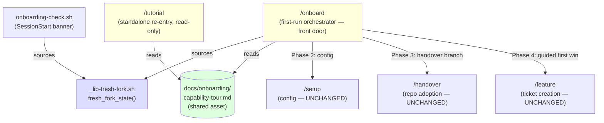
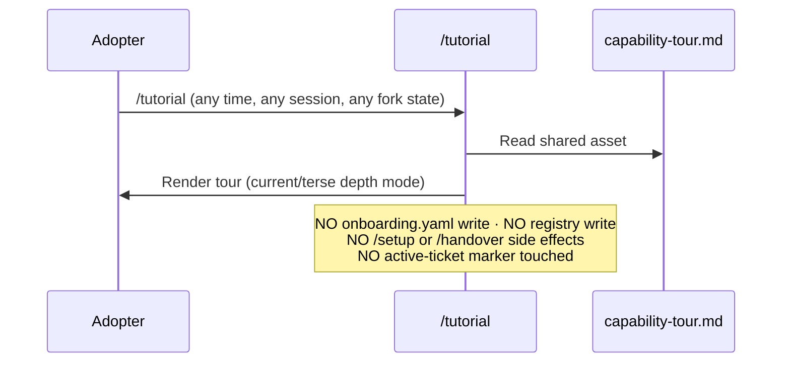

# Technical Design — Guided First-Run Onboarding, Increment 1 (Thin-Slice First-Run Flow)

**Status**: In Review
**Author**: Hisham (Tech Lead) — drafted via Claude Code session
**Date**: 2026-07-16
**Ticket**: [me2resh/apexyard#909](https://github.com/me2resh/apexyard/issues/909)
**PRD**: [`docs/prds/onboarding-overhaul.md`](../prds/onboarding-overhaul.md) — *Guided First-Run Onboarding + Teach-in-Context* (#902 / #905)
**Builds against this design**: [#910](https://github.com/me2resh/apexyard/issues/910) (M2 — walking-skeleton first-run flow, terse), [#911](https://github.com/me2resh/apexyard/issues/911) (M3 — standalone `/tutorial` re-entry)
**Reviewer**: Tariq (Solution Architect) — Gate 3b, before Build

---

## Overview

### Summary

Increment 1 is the **walking skeleton** of the onboarding overhaul: the thinnest end-to-end first-run flow that takes a genuinely fresh fork from "I just cloned this" to a real, filed first ticket, plus a standalone way to re-open the tour later. It is built entirely from Claude Code primitives — one orchestrator skill, one standalone skill, one shared shell detection library, and one shared content asset — and it **reuses `/setup`, `/handover`, and `/feature` unchanged**. It ships terse-mode-only; the teach-in-context glossary and the terse/guided adaptivity are deliberately deferred to increment 2.

### Goals

- A brand-new adopter on a fresh fork gets, in one session: a scannable capability tour → an explicit *handover-vs-new-project* branch → a guided first win that ends in a visible "🎉 first ticket filed — #N" moment against a **real** tracker issue.
- The flow reuses the **single existing fresh-fork detection** mechanism (`onboarding-check.sh`), extracted into a shared library so there is exactly one source of truth — no competing detector (PRD Technical Constraint).
- The capability-tour content is a **shared asset**, authored once and consumed by both the first-run flow and the standalone re-entry point — never duplicated (FR-4, FR-10).
- A standalone re-entry skill (`/tutorial`) re-opens the tour at any later point, on any fork state, with **zero side effects** (no `onboarding.yaml` write, no registry write, no re-run of `/setup`/`/handover`).
- `/setup` and `/handover` behaviour is **byte-for-byte unchanged** for anyone who invokes them directly or via a scripted `--all`-style call (Backward-compatibility NFR).

### Non-Goals (this increment)

- The teach-in-context plain-language glossary (US-4) and just-in-time asides — increment 2.
- Terse/guided depth adaptivity with per-session override (US-5) — increment 2. Increment 1 renders a single terse mode for everyone (but *captures* the technical-level signal — see D5).
- The on-demand single-term glossary lookup in any session (FR-8) — increment 2.
- Re-architecting `/setup` or `/handover`, or changing any gate/permission — explicitly out of scope per the PRD Non-Goals.
- Any non-conversational surface (GUI/dashboard). Everything here is skills + one hook + one content file.

---

## Context & PRD Traceability

The PRD splits the work into two increments. This design covers **increment 1** — the "Thin first slice (walking-skeleton)" column of the PRD's *Thin First Slice vs. Full Vision* table. The requirements this design must satisfy:

| PRD ref | Requirement | Covered by |
|---------|-------------|------------|
| FR-1 / US-1 | Capability tour before config, on a genuinely fresh fork | D1, D2, D3 · `capability-tour.md` |
| FR-2 / US-2 | Handover-vs-new-project branch, routes accordingly | D1 · `/onboard` Phase 3 |
| FR-3 / US-3 | Guided first win via **real** `/feature`, visible success moment | D6 · `/onboard` Phase 4 |
| FR-7 | Thin slice ships as a single mergeable end-to-end unit (kept, walking-skeleton) | #910 |
| FR-10 / US-6 | Standalone re-entry point (`/tutorial`) independent of `/setup` | D3, D4 · #911 |
| Technical Constraint | No second fresh-fork detection mechanism | D2 (`_lib-fresh-fork.sh`) |
| Technical Constraint | Guided first win references a real ticket, never a placeholder | D6 (ticket-vocabulary compliance) |
| NFR Backward-compat | `/setup` / `/handover` unchanged for scripted use | D1 (orchestration, not modification) |
| Open Question (a) | Technical-level inference default | **Resolved — D5** |
| Open Question (b) | Guided first win before/after the branch | **Resolved — D6** |
| Open Question (e) | Standalone entry-point name | **Resolved — D4** |
| Open Question (d) | Where the tour content lives | **Resolved — D3** |

The two remaining PRD Open Questions (on-demand glossary in inc-1 vs inc-2; glossary content location) belong to the teach-in-context layer and are left to the increment-2 design — noted in **Open Questions** below.

---

## Key Decisions

This is the decision-dense core of the design. Six decisions (D1–D6); D1 is the highest-leverage call and the one most worth the reviewer's scrutiny.

### D1 — The first-run surface is a repurposed `/onboard` orchestrator, not a new skill or a modified `/setup`

FR-1 explicitly allows "a new first-run flow (skill or extension of `/setup`'s Step 1 detection)". Three shapes were on the table:

| Option | Pros | Cons |
|--------|------|------|
| **A. Extend `/setup` inline** (add tour + branch + first win into `/setup`) | One front door adopters already know; literally "reuses detection" | Risks the Backward-compat NFR (scripted `/setup --all` must stay byte-for-byte); `/setup` is already ~666 lines and would bloat further; couples config-bootstrap to experience-wrapper |
| **B. New `/first-run` skill** + keep `/onboard` deprecated | Clean separation; `/setup` untouched | Two adjacent names (`/first-run` **and** a dead `/onboard`) is confusing; net **+1** top-level skill while a deprecated redirect lingers |
| **C. Repurpose the deprecated `/onboard`** as the live orchestrator that routes to `/setup` + `/handover` + `/feature` | Zero net new skill count (reclaims a dead name); `/onboard` is *already* the conceptual router (setup-vs-handover); the name a newcomer intuitively types; the original deprecation reason ("it mixed two concerns") is **resolved** — the new `/onboard` doesn't mix, it *orchestrates* two purpose-specific skills | Reviving a deprecated alias needs a clear note; the current `/onboard` SKILL + the CLAUDE.md skill table must be rewritten |

**Chosen: C — repurpose `/onboard`.** `/onboard` today is a pure redirect ("use `/setup` or `/handover`"); the deprecation rationale was that the *old* `/onboard` conflated framework-bootstrap with per-project discovery. The new `/onboard` does the opposite of conflating — it is a thin **experience wrapper + router** that keeps `/setup` (config) and `/handover` (repo adoption) as separate, unchanged skills and simply sequences them behind a tour and a branch. This honours the Non-Goal ("don't replace `/setup` or `/handover`") and the Backward-compat NFR (both are invoked, never edited), while adding no lingering dead skill.

Consequence: `onboarding-check.sh`'s banner changes from "Run `/setup`" to "Run `/onboard`" (the guided front door); `/setup` remains directly runnable for adopters who want just the config bootstrap.

Recorded as [AgDR-0097](../agdr/AgDR-0097-onboard-first-run-orchestrator.md).

> **Reviewer note:** D1 is the load-bearing call. If the reviewer prefers a net-new `/first-run` (Option B) for discoverability-audit or deprecation-hygiene reasons, everything downstream (D2–D6, the task breakdown) is unaffected except the skill's *name* — the architecture is identical.

### D2 — One fresh-fork detector, extracted into `_lib-fresh-fork.sh`

The PRD Technical Constraint is explicit: *"must not introduce a second, competing fresh-fork detection mechanism — it extends the one `/setup` already uses."* Today that logic lives inline inside `onboarding-check.sh` (SessionStart hook): resolve `onboarding.yaml` via `portfolio_onboarding_path`, treat *absent-file-but-example-present* or *placeholder `company.name`* as unconfigured.

**Decision:** extract that logic verbatim into a new sourceable library `.claude/hooks/_lib-fresh-fork.sh` exposing one function, and have **both** the hook and `/onboard` source it. No detection logic is written twice.

```
fresh_fork_state()   # echoes one of: fresh | configured | not-a-fork
                     #   fresh       → onboarding.yaml absent (example present) OR placeholder company.name
                     #   configured  → real onboarding.yaml with non-placeholder company.name
                     #   not-a-fork  → no onboarding.yaml and no onboarding.example.yaml
```

`onboarding-check.sh` becomes a thin caller (`[ "$(fresh_fork_state)" = fresh ] && echo "…run /onboard"`). `/onboard` calls the same function to decide whether to run the full guided flow, offer a re-run, or bail. This is the same refactor shape the audit-persistence design used for `_lib-audit-history.sh` — behaviour-preserving extraction, unit-testable in isolation.

Recorded as [AgDR-0098](../agdr/AgDR-0098-fresh-fork-detection-shared-lib.md).

### D3 — Capability-tour content is a shared asset at `docs/onboarding/capability-tour.md`

FR-4 requires the tour content be "reusable across skills, not locked inside the new flow", and FR-10/US-6 requires the standalone `/tutorial` to render "the **same** capability tour content the first-run flow uses". Two shapes:

| Option | Pros | Cons |
|--------|------|------|
| **Inline in each skill** (tour prose embedded in `/onboard` and again in `/tutorial`) | No indirection | Duplication → the two drift; violates FR-4 "reusable, not locked inside" |
| **Single shared content file** both skills `Read` | One source of truth; adopters can read it directly; increment 2 grows the same file (adds glossary) | One extra file + a documented read-contract |

**Chosen: shared content file** at `docs/onboarding/capability-tour.md`. Both `/onboard` (Phase 1) and `/tutorial` `Read` it and render it in the current depth mode. Rationale mirrors the framework's own `templates/audits/<dim>.md` precedent (author-once, consume-many). Increment 2 adds a sibling `docs/onboarding/glossary.md` consumed by the same two skills plus the on-demand lookup — the directory is the seam.

Content shape (terse, scannable — *not* the full 64-skill table, per US-1 AC): three short sections — **what a role is**, **what a skill is**, **what a gate is** — one to two sentences each with one concrete example, and a one-line "how the loop works" closer (idea → ticket → PR → review → merge). Skippable in one word ("skip").

### D4 — The standalone re-entry point is named `/tutorial`

PRD Open Question (e) leaves `/tutorial` vs `/learn` open. Both are functionally identical; this is a naming/discoverability call.

**Chosen: `/tutorial`.** Rationale: (1) it is the term the PRD and ticket #911 already use ("standalone `/tutorial` re-entry point"); (2) "tutorial" names the mental model precisely — *re-open the walkthrough* — whereas `/learn` reads as open-ended ("learn *what*?"); (3) it reads well in the first-run closing line ("come back anytime with `/tutorial`"). Runner-up `/learn` is recorded as an acceptable alternative if the reviewer prefers it; the implementation is identical either way.

`/tutorial` is its **own** skill (not a mode of `/onboard`), because US-6 demands it be invokable with zero `/setup`/`/handover` coupling and work on *any* fork state — a cold, side-effect-free read of the shared asset. Making it a flag on `/onboard` would drag the orchestrator's bootstrap/branch machinery into a read-only path.

### D5 — Technical-level inference: infer silently from the stack description; ask only when ambiguous *(resolves PRD Open Question a)*

PRD Open Question (a): *should technical-level inference default to "ask directly" or "infer silently from stack description" when both signals are weak?*

**Resolution: infer silently from the stack description by default; fall back to one low-friction direct question only when that description is absent or genuinely ambiguous.** Rationale:

- US-5 AC itself names the stack description (`/setup` Step 2's "tell me about your company and tech stack") as the primary inference source — a fluent stack description implies engineer-level comfort. The signal is already being collected; asking a redundant "have you used git?" on top of a fluent description is friction the primary (engineer) persona resents.
- The NFR *Reversibility* guarantees the adopter can override in plain language at any time, so a wrong silent inference is cheap to correct — favouring silent-infer over interrogate is the low-regret default.
- The direct-ask fallback ("Have you used git/GitHub before?") fires only in the ambiguous/empty-description case, matching the US-5 AC's own "when the inference is ambiguous" clause.

**Increment-1 scope caveat:** increment 1 ships **terse mode only** (per the PRD Thin-Slice table — "single terse mode for everyone"). So in increment 1 the inference *captures and records* the technical-level signal but does **not** branch rendering. Increment 2 activates the terse/guided split on the exact same captured signal — forward-compatible, no rework. Recording the signal now (a one-line note in session state) is the seam that lets increment 2 avoid re-asking.

### D6 — The guided first win runs **after** the branch resolves *(resolves PRD Open Question b)*

PRD Open Question (b): *does the guided first win need a project already registered (post-branch), or can it run before the branch resolves using placeholder context?*

**Resolution: after the branch resolves.** The guided first win files a **real** `/feature` ticket (FR-3, and the ticket-vocabulary Technical Constraint forbids a placeholder `#N`). `/feature` resolves its target from the active ticket or the registry; before the branch resolves there is no registered project, so a pre-branch first win would have nowhere real to file — precisely the placeholder failure mode the constraint prohibits. Sequencing it after the branch means:

- **Handover path** — `/handover` has just registered the adopted repo; `/feature` files against it.
- **New-project path** — the lightweight new-project registration has just created a project entry; `/feature` files against its repo.

**Greenfield-no-repo edge case (must-handle):** the new-project path may register a project that has *no GitHub repo yet* (truly greenfield). `/feature` needs a real tracker target. Handling, in priority order: (1) if the new-project registration created/linked a repo, file there; (2) otherwise offer to create the repo first (`gh repo create`, confirm before running); (3) otherwise **honestly defer** — "your project has no repo yet, so there's nothing to file into; run `/feature` once your repo exists" — which is exactly the US-3 *decline* path and the Edge-Cases honesty standard (never fabricate a success). This keeps the flow truthful when the loop genuinely can't complete.

---

## Architecture

### Surface inventory

Everything increment 1 adds or touches, by layer:

| Layer | Artifact | New / Changed | Purpose |
|-------|----------|---------------|---------|
| Skill | `.claude/skills/onboard/SKILL.md` | **Rewritten** (was deprecated redirect) | Guided first-run orchestrator (front door) |
| Skill | `.claude/skills/tutorial/SKILL.md` | **New** | Standalone, side-effect-free re-entry to the tour |
| Hook lib | `.claude/hooks/_lib-fresh-fork.sh` | **New** | Single fresh-fork detector, sourced by the hook + `/onboard` |
| Hook | `.claude/hooks/onboarding-check.sh` | **Changed** (thin) | Sources the lib; banner now recommends `/onboard` |
| Content | `docs/onboarding/capability-tour.md` | **New** | Shared tour content (source of truth) |
| Config | `.claude/project-config.defaults.json` → `ticket.bootstrap_skills` | **Changed** | Add `onboard`, `tutorial` (run before a portfolio exists) |
| Reused **unchanged** | `/setup`, `/handover`, `/feature` | — | Config bootstrap, repo adoption, ticket creation |
| Docs | `CLAUDE.md` skill table + `.claude/skills/onboard` one-liner | **Changed** | Reflect `/onboard` (live) + `/tutorial` (new) |

### Component diagram



The green node (shared content) and the blue node (shared detector) are the two "author-once" seams that satisfy the no-duplication and single-detector constraints. The yellow nodes are the two skills this increment authors; the three unstyled skills are reused verbatim.

### Control flow — the first-run orchestration (`/onboard`)

```mermaid
sequenceDiagram
    participant U as Adopter
    participant O as /onboard
    participant L as _lib-fresh-fork.sh
    participant S as /setup (unchanged)
    participant H as /handover (unchanged)
    participant F as /feature (unchanged)

    U->>O: /onboard (or nudged by SessionStart banner)
    O->>L: fresh_fork_state()
    L-->>O: fresh | configured | not-a-fork
    Note over O: configured → offer re-run only (Edge Case)<br/>not-a-fork → bail
    O->>U: Capability tour (from shared asset); "skip" to skip
    O->>S: Phase 2 — run config bootstrap (Steps 2–7)
    Note over O,S: tech-level signal INFERRED from<br/>the stack description (D5), recorded
    O->>U: Branch — "handing over a repo, or starting new?"
    alt Handing over
        O->>H: route with repo path/URL (unchanged behaviour)
        H-->>O: project registered
    else Starting new
        O->>O: lightweight new-project registration
    end
    O->>F: Phase 4 — guided first win ("try /feature")
    alt Accepts & real repo target exists
        F-->>O: real issue #N
        O->>U: "🎉 First feature filed — #N. idea → ticket → PR → review → merge"
    else Declines / no repo yet (greenfield)
        O->>U: honest note — "run /feature anytime once your repo exists"
    end
    O->>U: Closing — "come back anytime with /tutorial"
```

### Control flow — the standalone re-entry (`/tutorial`), deliberately disconnected



`/tutorial` never calls `fresh_fork_state()` for gating — it works identically whether the fork is fresh, configured, or predates this feature (US-6 AC + Edge Case: "cold invocation, show the tour from scratch").

### Shared detection library — API

`.claude/hooks/_lib-fresh-fork.sh`, sourced via `source "$(git rev-parse --show-toplevel)/.claude/hooks/_lib-fresh-fork.sh"`:

| Function | Returns | Behaviour |
|----------|---------|-----------|
| `fresh_fork_state` | stdout: `fresh` \| `configured` \| `not-a-fork`; exit 0 | Resolves `onboarding.yaml` via `portfolio_onboarding_path` (handles single-fork **and** split-portfolio v2), applies the exact `onboarding-check.sh` rules: absent file + present example → `fresh`; placeholder `"Your Company Name"` → `fresh`; real value → `configured`; neither file → `not-a-fork`. |

Contract: the function is **read-only** (no writes, no network), so it is safe to call from a SessionStart hook and from a bootstrap skill alike. It is the single point that both consumers depend on — the "no second detector" guarantee is structural, not conventional.

### Shared content asset — read contract

`docs/onboarding/capability-tour.md` is plain framework-authored markdown (MIT source header like every other doc). The read contract both skills honour:

- Terse, scannable: role / skill / gate, one-to-two sentences each + one example each; one "how the loop works" closer.
- No adopter-specific data — it is static framework content, identical across forks.
- Increment 2 appends a `## Glossary` companion (or a sibling `glossary.md`) without changing this file's tour section — the tour section is a stable anchor.

---

## Backward Compatibility & Reuse

The Backward-compatibility NFR ("`/setup` and `/handover` behavior is unchanged … Existing automation continues to work byte-for-byte") is satisfied **structurally**, because this increment never edits those skills — it *sequences* them:

- `/setup` — invoked by `/onboard` Phase 2 for the config bootstrap; a direct `/setup` or scripted `/setup --all` runs exactly as today. The only change adjacent to `/setup` is the SessionStart banner text (which recommends `/onboard`), not `/setup`'s own behaviour.
- `/handover` — invoked by `/onboard`'s handover branch with the repo path/URL; a direct `/handover <repo>` is unchanged.
- `/feature` — invoked by the guided first win; unchanged, and its ticket-vocabulary discipline (real `#N`, active-issue-skill marker) is inherited, which is exactly why D6 files *after* the branch.

The one genuinely shared mechanism — fresh-fork detection — is de-duplicated *toward* a single implementation (D2), the opposite of introducing a competing one.

**Bootstrap-gate coherence.** `/onboard` and `/tutorial` run before any portfolio/tracker exists, so `require-active-ticket.sh` would otherwise block their writes. Both are added to `ticket.bootstrap_skills` (defaults). `/onboard` writes `.claude/session/active-bootstrap` = `onboard` on entry and clears it on every exit (the `clear-bootstrap-marker.sh` SessionStart hook sweeps stale markers) — the same pattern `/setup` uses. `/tutorial` is read-only and needs no writes, but is listed for defence-in-depth in case a future tour rendering caches anything.

---

## Standalone `/tutorial` Reusability Spec (the #911 dependency)

Ticket #911 (M3) builds `/tutorial`, but its reusability is designed **here** so #910 lays the seam correctly. The contract #910 must create and #911 must consume:

1. **Single content source.** #910 creates `docs/onboarding/capability-tour.md` and makes `/onboard` render *from it* (not from inline prose). #911's `/tutorial` `Read`s the *same* file. Neither skill embeds tour prose.
2. **Rendering parity.** Both skills render the same sections in the same order; the only permitted divergence is depth mode (terse-only in increment 1, so no divergence yet).
3. **No shared *state*, only shared *content*.** `/tutorial` must not read first-run session state to function (US-6 AC: works even on forks configured before this feature). It reads the static asset and, per D5, infers/asks depth mode fresh if none is set for the session.
4. **Discoverability.** `/onboard`'s closing line names `/tutorial`; `/tutorial` is added to the CLAUDE.md skill index. Both are #910/#911 doc tasks.

Because #911 depends on the asset from #910, **#910 must merge before #911 builds** (or #911 stubs the asset path). This is the one intra-increment ordering constraint; noted in the task breakdown.

---

## Implementation Plan

Two build tickets, both increment-1, both kept (walking-skeleton — full SDLC, **no** spike exemptions).

### #910 — M2: walking-skeleton first-run flow (terse) · P0

| # | Task | Est. | Depends on |
|---|------|------|-----------|
| 1 | `_lib-fresh-fork.sh` — extract `fresh_fork_state()` from `onboarding-check.sh` (behaviour-preserving) | 2h | — |
| 2 | Refactor `onboarding-check.sh` to source the lib; change banner to recommend `/onboard` | 1h | 1 |
| 3 | Author `docs/onboarding/capability-tour.md` (shared asset — role/skill/gate + loop closer, terse) | 2h | — |
| 4 | Rewrite `.claude/skills/onboard/SKILL.md` — orchestrator: detect → tour (read asset) → `/setup` config (infer+record tech-level, D5) → branch (D1) → guided first win via `/feature` (D6) → closing points at `/tutorial` | 4h | 1, 3 |
| 5 | Lightweight new-project registration path (registry entry; greenfield-no-repo handling per D6) | 2h | 4 |
| 6 | Add `onboard` to `ticket.bootstrap_skills`; bootstrap-marker write/clear on every exit path | 0.5h | 4 |
| 7 | `.claude/hooks/tests/test_fresh_fork.sh` — fresh / configured / not-a-fork; split-portfolio path resolution | 2h | 1 |
| 8 | Update `CLAUDE.md` skill table (`/onboard` now live; note `/tutorial` incoming) | 0.5h | 4 |

**~14h.** Ships as one PR — the lib + hook change + asset + orchestrator land together so nothing references a half-built seam.

### #911 — M3: standalone `/tutorial` re-entry (tour-only) · P1

| # | Task | Est. | Depends on |
|---|------|------|-----------|
| 1 | `.claude/skills/tutorial/SKILL.md` — read `docs/onboarding/capability-tour.md`, render terse; **no** side effects; works on any fork state | 3h | #910 tasks 3–4 |
| 2 | Add `tutorial` to `ticket.bootstrap_skills` (defence-in-depth) | 0.25h | 1 |
| 3 | `CLAUDE.md` skill index + one-line skill summary; verify `/onboard` closing line names `/tutorial` | 0.5h | 1, #910 t4 |
| 4 | Manual smoke: run `/tutorial` on a *configured* fork and a *pre-feature* fork — identical tour, zero writes | 1h | 1 |

**~4.75h.** Small by design — the reusability seam from #910 makes `/tutorial` a thin reader.

**Ordering:** #910 merges before #911 builds (the shared asset must exist). Both go through the normal SDLC — Rex review, QA (hypothesis: did a fresh adopter reach a real first ticket?), no exemptions.

---

## Risks & Mitigations

| Risk | Likelihood | Impact | Mitigation |
|------|-----------|--------|------------|
| Extracting detection into `_lib-fresh-fork.sh` changes the SessionStart banner behaviour (false fresh/configured) | Med | High | Task 7 unit tests the three states incl. split-portfolio path resolution *before* the hook is rewired; extraction is behaviour-preserving (same rules, same `portfolio_onboarding_path`). Revert is one commit. |
| Reviving deprecated `/onboard` confuses adopters who learned "it's deprecated" | Low | Med | The new `/onboard` *resolves* the original deprecation (it no longer conflates concerns — it routes to them). CLAUDE.md + the skill one-liner are updated in the same PR; the SessionStart banner points here. |
| Backward-compat break: `/onboard` driving `/setup` inline diverges from a direct `/setup` run | Low | High | `/onboard` *invokes* `/setup`'s documented steps, it does not fork them; `/setup` SKILL is untouched. QA includes a direct-`/setup` regression pass. |
| Guided first win fabricates a `#N` when greenfield has no repo | Low | High | D6 hard rule: file only against a real repo; otherwise honestly defer (US-3 decline path). Inherits `/feature`'s ticket-vocabulary + active-issue-skill marker discipline. |
| Tour content drifts between `/onboard` and `/tutorial` | Low | Med | D3 single-source asset; both skills `Read` it, neither embeds prose. Reusability spec makes this a review checkpoint. |
| `/onboard` bootstrap marker left set after an interrupted run → ticket gate stuck open | Low | Med | Marker cleared on every exit path; `clear-bootstrap-marker.sh` SessionStart sweep is the backstop (same as `/setup`). |
| Scope creep — glossary/adaptivity leak into increment 1 | Med | Med | This design fences them to increment 2 explicitly (Non-Goals + Open Questions); Rex/QA check the PR touches no glossary surface. |

---

## Security Considerations

- [x] No secrets — the tour asset is static framework text; `_lib-fresh-fork.sh` reads only `onboarding.yaml` presence/placeholder, never its secret-bearing values beyond the `company.name` placeholder check.
- [x] No new network calls — detection and rendering are local file I/O.
- [x] No gate/permission change — the PRD Non-Goal is honoured; `/onboard` cannot loosen any hook, and the guided first win goes through the same `/feature` path (and downstream merge/CEO gates) as any other ticket.
- [x] No PII — onboarding content is about the framework, not about users.
- [x] Path resolution via `portfolio_onboarding_path` / `portfolio_registry` — same trust boundary the rest of the framework uses; split-portfolio v2 forks resolve the sibling repo correctly, no new surface.
- [x] The rewritten `/onboard` orchestrating `/setup` does not weaken `/setup`'s own `jq` pre-flight or bootstrap-marker discipline — those run inside the invoked steps unchanged.

---

## Testing Strategy

| Type | Coverage | Notes |
|------|----------|-------|
| Bash unit | `fresh_fork_state()` — fresh / configured / not-a-fork, single-fork + split-portfolio v2 path | `test_fresh_fork.sh`, mirrors existing hook-test patterns; mocks `portfolio_onboarding_path` |
| Regression | Direct `/setup` and scripted `/setup --all` behaviour byte-for-byte vs pre-change | Guards the Backward-compat NFR |
| Integration (manual, PR smoke) | `/onboard` on a genuinely fresh fork → tour → `/setup` config → branch → `/feature` → real `#N` → 🎉; both branches; greenfield-no-repo defer path | The walking-skeleton acceptance walk |
| Integration (manual, PR smoke) | `/tutorial` on configured fork **and** pre-feature fork — identical tour, zero writes (`git status` clean) | US-6 AC verification (#911) |
| QA (hypothesis) | Did a fresh adopter reach a real filed first ticket in one session? (PRD success metric ≥80%) | QA phase, per walking-skeleton discipline |

---

## Open Questions (deferred to increment 2, not blocking this design)

| Question | Owner | Status |
|----------|-------|--------|
| Should the on-demand single-term glossary lookup (FR-8) ship in inc-1 or inc-2? | Product Manager | Deferred to inc-2 per PRD; revisit only if #910 build cost leaves headroom |
| Where does the plain-language **glossary** content live (sibling `docs/onboarding/glossary.md` vs appended to the tour asset)? | Tech Lead | Deferred to the increment-2 design; the `docs/onboarding/` directory is pre-established here as the seam |
| Does reviving `/onboard` (D1-C) vs a net-new `/first-run` (D1-B) better serve long-term skill-index hygiene? | Tech Lead + Solution Architect | **Open for this review** — see D1 reviewer note; downstream design is name-agnostic |

---

## Approvals

| Role | Name | Date | Status |
|------|------|------|--------|
| Tech Lead (author) | Hisham | 2026-07-16 | Author |
| Solution Architect (Gate 3b) | Tariq | | Pending — `/design-review` |
| Head of Engineering (escalation) | Khalid | | Not required — no new tech stack / cross-project surface |

---

*Part of [ApexYard](https://github.com/me2resh/apexyard) — multi-project SDLC framework for Claude Code · MIT.*
