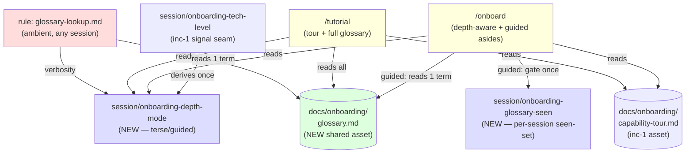
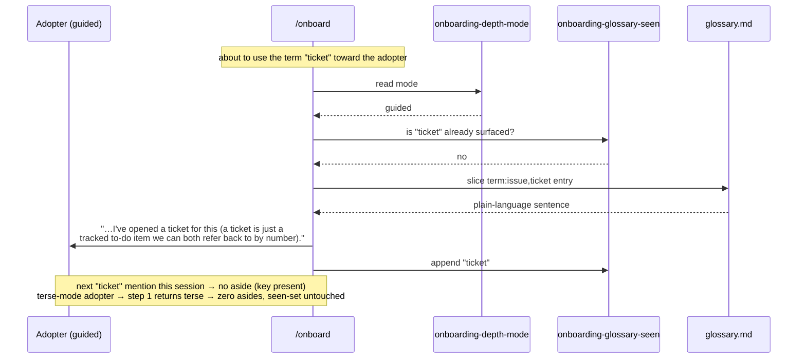
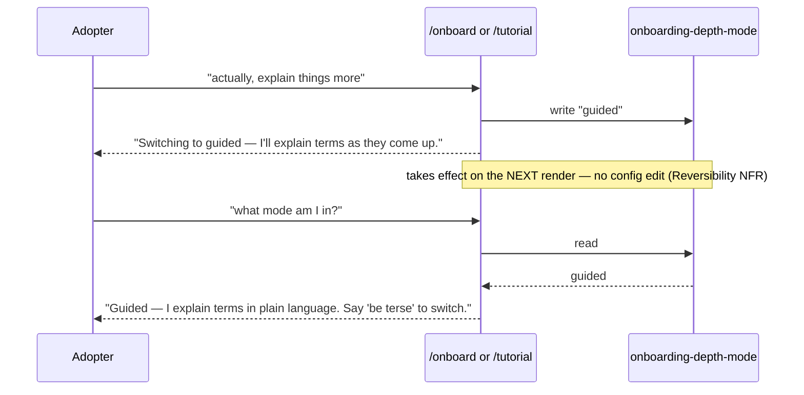
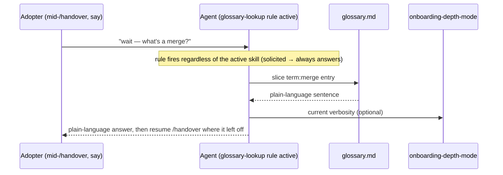

<!-- Source: ApexYard · docs/technical-designs/onboarding-increment-2.md · github.com/me2resh/apexyard · MIT -->

# Technical Design — Guided First-Run Onboarding, Increment 2 (Teach-in-Context Education Layer)

**Status**: In Review
**Author**: Hisham (Tech Lead) — drafted via Claude Code session
**Date**: 2026-07-16
**Ticket**: [me2resh/apexyard#912](https://github.com/me2resh/apexyard/issues/912)
**PRD**: [`docs/prds/onboarding-overhaul.md`](../prds/onboarding-overhaul.md) — *Guided First-Run Onboarding + Teach-in-Context* (#902 / #905)
**Builds on**: [`docs/technical-designs/onboarding-increment-1.md`](onboarding-increment-1.md) (the shipped walking skeleton — reuses its `/onboard`, `/tutorial`, `docs/onboarding/capability-tour.md`, and the `.claude/session/onboarding-tech-level` signal seam)
**Builds against this design**: [#913](https://github.com/me2resh/apexyard/issues/913) (M5 — glossary + just-in-time asides), [#914](https://github.com/me2resh/apexyard/issues/914) (M6 — depth adaptivity), [#915](https://github.com/me2resh/apexyard/issues/915) (M7 — on-demand lookup + full `/tutorial` glossary)
**Reviewer**: Tariq (Solution Architect) — Gate 3b, before Build

---

## Overview

### Summary

Increment 2 adds the **teach-in-context education layer** the increment-1 walking skeleton deliberately deferred: a plain-language glossary for the five core SDLC terms, just-in-time asides that explain each term the first time a non-technical adopter meets it, and a terse-vs-guided depth mode rendered on the **same** first-run flow — not a forked skill. It is built entirely from Claude Code primitives — one new shared content asset, one new ambient rule, two new gitignored session markers, and edits to the two skills increment 1 already shipped (`/onboard`, `/tutorial`). It **adds no new top-level skill** and **changes no gate, permission, or role boundary** — the whole layer is presentation.

Crucially, it renders off seams increment 1 already laid: the `.claude/session/onboarding-tech-level` signal (captured but unused in increment 1) now drives depth mode with **zero rework**, and the new glossary asset lands in the `docs/onboarding/` directory increment-1 D3 pre-established for exactly this.

### Goals

- A non-technical adopter in **guided mode** gets a short plain-language aside the first time framework output uses each of *issue/ticket, PR, merge, branch, CI* — once per term, per session, inline, never a wall of definitions (US-4, FR-5).
- A **technical adopter in terse mode sees zero asides** by default — the primary persona is never slowed by explanations they don't need (US-4 AC, FR-5).
- Onboarding depth (**terse vs guided**) is chosen on the *same* flow from the increment-1 tech-level signal, is **overridable in plain language mid-session with immediate effect**, and is transparent on request ("what mode am I in?") — US-5, FR-6, FR-9.
- Any adopter can ask "what's a merge?" in **any session, regardless of active skill**, and get the plain-language answer from the one shared glossary (FR-8).
- The increment-1 `/tutorial` (tour-only) **grows** to serve the full glossary too, respecting depth mode, reusing the same shared assets — US-6 in full (FR-10).
- The plain-language glossary is a **single shared asset** consumed by all three surfaces (asides, `/tutorial`, on-demand lookup), never duplicated (FR-4) — the same author-once/consume-many discipline as increment-1's tour asset.

### Non-Goals

- Re-architecting `/setup`, `/handover`, `/feature`, or the increment-1 `/onboard`/`/tutorial` *flow shape* — this increment extends `/onboard` and `/tutorial` with depth-aware rendering, it does not change what they orchestrate or their side-effect contracts.
- Any change to who can do what — no gate, permission, approval, or role boundary is touched. Guided-mode explanations describe the existing gates in plainer words; they never loosen one (PRD Non-Goal + US-5 AC + NFR Consistency).
- Localization / non-English glossary — plain-language *English* only (PRD Non-Goal).
- Fork-lifetime "already learned" tracking, streaks, or any retention mechanic — "first encounter" is scoped **per session** (PRD Non-Goal: no gamification).
- A new top-level skill. FR-8's on-demand lookup is an **ambient rule**, not a `/glossary` command, and the full re-entry stays the existing `/tutorial` — net-new skill count for this increment is **zero** (continues increment-1's zero-net-new-skill ethos).

---

## Context & PRD Traceability

This design covers **increment 2** — the "Full vision" column of the PRD's *Thin First Slice vs. Full Vision* table that increment 1 left open. Requirements this design must satisfy:

| PRD ref | Requirement | Covered by |
|---------|-------------|------------|
| FR-4 / US-4 | Plain-language glossary (issue/ticket, PR, merge, branch, CI), reusable across skills, not locked in one flow | D1 · `docs/onboarding/glossary.md` · AgDR-0100 |
| FR-5 / US-4 | Just-in-time asides on first encounter, **guided mode only**; terse sees zero | D3 · AgDR-0101 · `onboarding-glossary-seen` marker |
| FR-6 / US-5 | Terse vs guided on the **same** flow (not forked); infer from the inc-1 signal; override in plain language, immediate | D2 · `onboarding-depth-mode` marker |
| FR-9 / US-5 | "What mode am I in?" transparency affordance | D2 |
| FR-8 | On-demand single-term lookup in **any session**, any active skill | D4 · `.claude/rules/glossary-lookup.md` |
| FR-10 / US-6 (full) | `/tutorial` re-opens tour **+ full glossary**, respecting depth mode | D5 · grows the inc-1 `/tutorial` |
| NFR Consistency | Plain-language asides never misstate the real mechanism | D1 read-contract (no jargon-on-jargon) + D6 (Consistency) |
| NFR Reversibility | Depth switch instantaneous, lossless, no config edit | D2 (session marker flip) |
| NFR Backward-compat | `/setup`/`/handover` unchanged; terse-only adopters unaffected | D2 safe default (absent mode → terse) |

### What increment 1 already shipped that this builds on

| Inc-1 seam | Where | How increment 2 uses it |
|------------|-------|-------------------------|
| `.claude/session/onboarding-tech-level` ∈ `engineer`/`non-engineer`/`ambiguous` | `/onboard` Phase 2 (D5) | Depth mode is **derived** from this (D2) — no re-asking, no rework |
| `docs/onboarding/capability-tour.md` shared asset | inc-1 D3 | The new `glossary.md` is its sibling in the same seam directory; `/tutorial` reads both |
| `docs/onboarding/` directory | inc-1 D3 | Pre-established seam — glossary lands here, no new directory decision |
| `/tutorial` (tour-only, read-only) | inc-1 #911 | **Grown** to render the full glossary too (D5), respecting depth mode |
| `/onboard` (terse-only orchestrator) | inc-1 #910 | Gains depth-aware rendering + guided asides; flow shape unchanged |
| Session-marker + `clear-*-marker` SessionStart idiom | inc-1 "Bootstrap-gate coherence" | The two new markers reuse this write/clear/sweep pattern |

---

## Key Decisions

Five decisions (D1–D5) plus two cross-cutting notes (D6 Consistency, D7 the intra-increment build seam). D1 (glossary storage) and D3 (aside firing) are the two AgDR-class calls and the ones most worth the reviewer's scrutiny.

### D1 — The glossary is a structured markdown sibling `docs/onboarding/glossary.md` *(resolves PRD Open Question "where does the glossary live")*

FR-4 requires the glossary be "reusable across skills, not locked inside the new flow" and available to the on-demand lookup outside the first-run flow. Three consumers read it at three granularities: `/onboard` asides read **one** term; `/tutorial` renders **all**; the on-demand lookup resolves **one** term the adopter names.

| Option | Pros | Cons |
|--------|------|------|
| **A. Append a `## Glossary` to `capability-tour.md`** | No new file | Couples two assets with different render cadences (tour = whole/in-order; glossary = per-term); muddies `/tutorial`'s clean "render the tour" contract; a per-term aside must slice a sub-section from a mixed-purpose file |
| **B. Structured data file** (`glossary.yaml`/`.json`) | Trivially per-term addressable | Breaks the framework's markdown-asset convention (`capability-tour.md`, `templates/audits/<dim>.md`); needs `yq`/`jq` on a plain-text lookup path; harder for a non-engineer maintainer to reword |
| **C. Structured markdown sibling** — one term per stable `###` heading + a greppable `<!-- term: … -->` key *(chosen)* | Single source of truth in the same markdown idiom; human-editable; per-term addressable via the anchor; `/tutorial` renders whole, asides/lookups slice one anchor; sits in the inc-1 `docs/onboarding/` seam | A light heading/anchor read-contract to document (not a parser) |

**Chosen: C.** Full read-contract in § "Shared glossary asset — read contract". Rationale: the framework's precedent is that shared *content* is markdown, not data — reading one plain-text section needs no tooling on the path, and a non-technical maintainer can reword a definition without a schema. The heading-anchor + `term:` key delivers Option B's addressability without its dependency/readability costs, and a separate file keeps `/tutorial`'s increment-1 "render the tour" contract intact. Recorded as [AgDR-0100](../agdr/AgDR-0100-onboarding-glossary-storage.md).

> **Reviewer note:** this resolves the increment-1 design's own deferred Open Question ("sibling `glossary.md` vs appended to the tour asset") in favour of the sibling — exactly the shape increment-1 D3 anticipated ("Increment 2 adds a sibling `docs/onboarding/glossary.md` … the directory is the seam").

### D2 — Depth mode is a session marker `.claude/session/onboarding-depth-mode`, derived from the inc-1 tech-level signal, overridable with immediate effect

US-5/FR-6 require terse vs guided on the *same* flow, inferred from the increment-1 signal, overridable in plain language with immediate effect; FR-9 requires it be reportable on request.

**The signal vs the mode — two distinct things.** Increment 1 captured `.claude/session/onboarding-tech-level` ∈ {`engineer`, `non-engineer`, `ambiguous`} — the *inference input*. Increment 2 needs the *effective rendering setting* ∈ {`terse`, `guided`}, which the adopter can flip. Overloading one file would conflate "what we inferred" with "what the adopter chose" and corrupt the inference on an override. So:

**Decision: a second, separate session marker `.claude/session/onboarding-depth-mode` ∈ {`terse`, `guided`}.**

- **Derivation** (build in #914): at the start of a rendering flow, if the mode marker is absent, derive it once from the tech-level signal — `engineer → terse`, `non-engineer → guided`. If the signal itself is absent/`ambiguous` (e.g. a cold `/tutorial` on a fork that never ran `/onboard`), infer/ask fresh per the increment-1 D5 rule (one low-friction question), then write the result.
- **Override** (build in #914): plain-language phrases flip the marker and take effect on the *next* render — "explain more" / "explain things more" / "I don't know these terms" → write `guided`; "skip the explanations" / "be terse" / "I know this already" → write `terse`. No config file is edited (NFR Reversibility — a session-marker flip is instantaneous and lossless).
- **Transparency, FR-9** (build in #914): "what mode am I in?" reads the marker (default `terse` if absent) and reports it plainly plus how to change it — e.g. *"You're in terse mode — I skip the plain-language explanations. Say 'explain more' to switch to guided."*

**The safe default is `terse` (absent marker → terse).** This protects the primary engineer persona from unwanted asides and makes the #913/#914 parallel build safe (see D7). It also honours the Backward-compat NFR: an adopter who never engages the depth machinery renders exactly as increment-1's terse-only world did.

**Unsolicited vs solicited teaching — the gate only governs unsolicited.** Depth mode gates *unsolicited* teaching (the asides + guided narration in `/onboard`). *Solicited* teaching — the adopter typing "what's a merge?" (D4) or running `/tutorial` (D5) — always answers, because the adopter asked; depth mode only tweaks verbosity there, it never withholds a requested answer. This is the clean line that keeps "terse sees zero asides" true while never leaving someone who *asked* without an answer.

> This is **not** an AgDR-class call — it is a natural, forward-compatible extension of the increment-1 D5 signal seam (the framework's session-marker idiom, applied twice more). It is recorded here in the design body, not as a separate AgDR.

### D3 — Just-in-time asides fire via a per-session seen-set marker, gated on guided mode *(FR-5)*

FR-5/US-4 require the aside to fire on **first encounter** of each term, **once**, in **guided mode only**, terse seeing **zero**. "First encounter, once" needs a memory of what's been surfaced.

| Option | Pros | Cons |
|--------|------|------|
| **A. In-context self-discipline** (agent remembers) | Zero new state | Fails across context compaction — exactly in the long guided sessions this targets; not testable; no account of "did terse see zero?" |
| **B. Per-session seen-set marker** `.claude/session/onboarding-glossary-seen`, gated on mode `guided` *(chosen)* | Deterministic once-per-term regardless of compaction; greppable + unit-testable; mirrors the `active-bootstrap` idiom | One gitignored file + a clear-on-session-start sweep |
| **C. Hook injects asides** | Fully mechanical | A hook cannot edit assistant prose (emits its own banner) — can't produce the *inline* parenthetical the AC demands; injecting teaching by scanning output is the derailing "mode switch" the AC forbids |

**Chosen: B.** The firing algorithm:

1. **Gate on mode first** — read `onboarding-depth-mode` (D2). Not `guided` → emit no aside, don't touch the seen-set. Terse's "zero asides" is structural.
2. **Check the seen-set** — in guided mode, before using one of the five terms toward the adopter, read `.claude/session/onboarding-glossary-seen` (newline-delimited term-keys). Key present → emit the term plainly, no aside.
3. **Surface + record** — key absent → slice that term's sentence from `glossary.md` (via its `term:` key, D1), emit the single-line parenthetical inline, append the key to the seen-set.
4. **Clear on session boundary** — the marker is per-session; a returning adopter gets the refresher again. Swept by the existing `clear-*-marker` SessionStart pattern.

"First encounter" is deliberately **per-session, not per-fork** — fork-lifetime suppression would deny a returning non-technical adopter the refresher US-4 exists to give, and needs persistent state this scope explicitly excludes. Recorded as [AgDR-0101](../agdr/AgDR-0101-jit-aside-first-encounter-detection.md).

### D4 — On-demand lookup (FR-8) is an ambient rule `.claude/rules/glossary-lookup.md`, not a skill

FR-8 requires "what's a merge?" to resolve in **any session regardless of which skill is active** — the PRD edge case is explicit that it must work mid-`/handover`, mid-`/setup`, anywhere.

| Option | Pros | Cons |
|--------|------|------|
| **A. New `/glossary <term>` skill** | Discoverable by name | Requires the adopter to know + type a command; a skill is *invoked*, not *ambient* — doesn't naturally answer a plain-language "what's a merge?" dropped mid-another-skill; +1 top-level skill |
| **B. Ambient rule** imported via `CLAUDE.md` *(chosen)* | Always-loaded context; the agent answers the plain-language question in-place, in any session, inside any active skill; zero new skill surface | Self-discipline enforcement shape (a rule can't be mechanically fired) — honest about its limits, same as `reporting-style.md` / `plan-mode.md` |

**Chosen: B.** `.claude/rules/glossary-lookup.md`: *when an adopter asks the meaning of one of the five core terms (or "what's a `<term>`?") in any session, resolve it from `docs/onboarding/glossary.md` (slice the `term:` anchor) and answer in plain language, in the current depth mode's verbosity.* This is the only shape that satisfies "any session, any active skill" without the adopter knowing a command — a genuinely ambient affordance. Enforcement is self-discipline (advisory), the same shape as the framework's other prose-behaviour rules; that is stated plainly in the rule and the risk register. A `/glossary` skill was considered and rejected to keep net-new skill count at zero and because a command is the wrong ergonomics for a mid-conversation lookup.

### D5 — `/tutorial` grows to render the full glossary, respecting depth mode *(US-6 full / FR-10)*

Increment 1's `/tutorial` is tour-only and read-only. US-6 in full requires it re-open the tour **and** the teach-in-context glossary, in the adopter's depth mode.

**Decision: extend the existing `/tutorial` (build in #915) — do not add a skill.**

- After rendering the tour asset (unchanged inc-1 behaviour), `/tutorial` reads `docs/onboarding/glossary.md` and renders all five entries.
- Depth mode (D2) tunes verbosity: terse renders the definitions compactly; guided adds the "why this matters" framing. Because a `/tutorial` invocation is *solicited* (D2), the glossary is always shown — depth mode never withholds it; if no mode is set for the session, `/tutorial` infers/asks fresh per D5-of-inc-1, defaulting to showing the content.
- `/tutorial` stays **read-only and side-effect-free** — the increment-1 contract holds byte-for-byte (no `onboarding.yaml`/registry/active-ticket writes). Reading the depth-mode marker is a read; it may *ask* for a mode but writing that choice is the depth-mode override path (D2), consistent with "solicited" teaching.

This keeps US-6's "same content, one asset, rendered by both surfaces" true — `/onboard` asides and `/tutorial` full render read the *same* `glossary.md`, never duplicated (the increment-1 reusability spec, extended to the glossary asset).

### D6 — Consistency: guided asides simplify, never misstate *(NFR Consistency)*

The NFR is that a plain-language aside must be a *simplification*, never a *misstatement*, of the real mechanism (e.g. what a merge gate actually checks, per `.claude/rules/pr-workflow.md`). This is a **content-authoring constraint on `glossary.md`**, enforced at review: each definition is checked against the mechanism it describes so guided mode never tells a non-technical adopter something the framework will then contradict. It is a Rex/QA review checkpoint (like the inc-1 tour reusability spec), not a hook.

### D7 — Intra-increment build seam: #913 depends on #914's depth-mode contract; the safe default makes either order correct

Tickets #913 (asides) and #914 (depth mode) are **sibling tickets** — both blocked only by #912, both blocking #915 — so they may build in parallel. But #913's asides are *gated on guided mode*, which #914 owns. This design defines the contract so they build independently:

- The depth-mode seam (`.claude/session/onboarding-depth-mode`, values `terse`/`guided`, **absent → terse**) is specified **here**. #914 owns *writing* it (derivation + override); #913 owns *reading* it to gate asides.
- **Safe default:** absent marker → terse → zero asides. So even if #913's asides land before #914's writer, no aside ever leaks to a terse/unset adopter — the parallel build is correctness-safe.
- **Recommended (not required) order:** #914's mode-writer ideally lands with or before #913's asides go *live in guided* for the full experience; the safe default means there is no correctness risk if they interleave. This mirrors increment-1's #910-asset-before-#911 ordering seam.

---

## Architecture

### Surface inventory

Everything increment 2 adds or touches, by layer:

| Layer | Artifact | New / Changed | Purpose |
|-------|----------|---------------|---------|
| Content | `docs/onboarding/glossary.md` | **New** | Shared 5-term plain-language glossary (source of truth) — D1 / AgDR-0100 |
| Rule | `.claude/rules/glossary-lookup.md` | **New** | Ambient on-demand single-term lookup, any session — D4 / FR-8 |
| Session marker | `.claude/session/onboarding-depth-mode` | **New** | Effective depth mode `terse`/`guided`, overridable — D2 |
| Session marker | `.claude/session/onboarding-glossary-seen` | **New** | Per-session seen-set of surfaced term-keys — D3 / AgDR-0101 |
| Hook | `.claude/hooks/clear-*-marker` SessionStart sweep | **Changed** (or sibling added) | Sweep the two new per-session markers — D2/D3 |
| Skill | `.claude/skills/onboard/SKILL.md` | **Changed** | Depth-aware rendering + guided asides; flow shape unchanged (Rules #4 "terse only" lifted) |
| Skill | `.claude/skills/tutorial/SKILL.md` | **Changed** | Grows to render full glossary respecting depth mode — D5 (Rule #4 "tour-only" lifted) |
| Content | `docs/onboarding/capability-tour.md` | **Unchanged** | Its inc-2 forward-ref comment is resolved by D1; tour section stays a stable anchor |
| Reused **unchanged** | `/setup`, `/handover`, `/feature`, `_lib-fresh-fork.sh` | — | No touch — this layer is presentation only |
| Docs | `CLAUDE.md` (rules import list; `/onboard`/`/tutorial` one-liners) | **Changed** | Register `glossary-lookup.md`; reflect depth-aware `/onboard`/`/tutorial` |

### Component diagram

Green = the new shared content asset (one source, three readers). Blue = the two new session markers (the depth + first-encounter state). Red = the new ambient rule. Yellow = the two skills this increment edits. Everything else is reused unchanged.

### Control flow — guided-mode aside firing (`/onboard`, D3)

### Control flow — depth override + transparency (D2, FR-6/FR-9)

### Control flow — on-demand lookup, any session (D4, FR-8)

### Shared glossary asset — read contract

`docs/onboarding/glossary.md` is framework-static markdown (MIT header, like `capability-tour.md`). The contract all three readers honour (authored under #913):

- **Five entries, one per stable `###` heading**: `### issue / ticket`, `### PR (pull request)`, `### merge`, `### branch`, `### CI (continuous integration)`.
- **Each section's first line is a greppable key comment**: `<!-- term: issue,ticket -->` — lets a per-term reader locate an entry by key (comma-separated surface spellings map to one anchor: "issue" and "ticket" → the same entry) without positional assumptions.
- **Body: 1–3 plain-language sentences, no jargon-on-jargon** — any non-common-English word inside a definition is either inlined or is one of the other five terms (FR-4 AC + D6 Consistency).
- **`/tutorial` renders the whole file in order; asides + the lookup rule slice one anchored section by its `term:` key.** No consumer embeds the prose (the increment-1 no-duplication discipline, extended).
- **No adopter-specific data** — identical across forks, same as the tour asset.

### Depth mode is presentation only — the invariant

Every one of these surfaces changes **only whether/how much explanatory text accompanies otherwise-identical output**. None of them reads or writes a gate marker, a permission, a review-approval file, or a role boundary. A non-technical adopter in guided mode goes through the *exact same* PR / CEO-merge / QA gates as an engineer in terse mode — the only difference is that the gate is *explained* in plainer words as it's hit (US-5 AC, NFR Consistency). This invariant is the security story (§ Security Considerations) and a QA assertion.

---

## Backward Compatibility & Reuse

- **`/setup`, `/handover`, `/feature`, `_lib-fresh-fork.sh`** — untouched. This increment adds no orchestration; it enriches rendering inside the two onboarding skills only.
- **Terse-only adopters** render byte-for-byte as in increment 1: absent depth-mode marker → terse → zero asides → identical output. The new machinery is inert until an adopter is in guided mode or asks a lookup (NFR Backward-compat).
- **`capability-tour.md`** is not edited — its increment-2 forward-reference is *resolved* by the sibling-file decision (D1), not by changing the tour. `/tutorial`'s increment-1 tour render is unchanged; the glossary render is appended after it.
- **The one shared mechanism per new concern is de-duplicated toward a single implementation**: one glossary asset (D1), one depth-mode marker (D2), one seen-set marker (D3), one lookup rule (D4) — three readers per asset, never a second copy. This is the same author-once/consume-many guarantee increment 1 made structural for the tour + detector.

---

## Resolved PRD Open Questions

| PRD Open Question | Resolution | Where |
|-------------------|------------|-------|
| Where does the plain-language glossary content live? | **Structured markdown sibling `docs/onboarding/glossary.md`** (one term per `###` anchor + `term:` key), in the inc-1 seam directory | D1 · AgDR-0100 |
| Should the on-demand glossary lookup (FR-8) ship in inc-1 or inc-2? | **Increment 2**, in #915 (M7) — as an ambient rule, not a skill | D4 · scoping below |
| Should technical-level inference default to "ask" or "infer silently"? | **Already resolved in increment-1 D5** — infer silently from the stack description, ask only when ambiguous. Increment 2 *activates* that captured signal to derive depth mode; the inference default is settled and carried forward unchanged (no re-litigation) | D2 |
| What is the standalone entry point named? | **Already resolved in increment-1 D4** — `/tutorial`. Increment 2 grows it (D5); the name is settled | D5 |

All four are closed: two resolved here (glossary storage; FR-8 placement), two confirmed carried-forward from increment 1 (inference default; entry-point name). No PRD Open Question remains open after this design.

---

## Implementation Plan

Three build tickets, all increment-2, all kept (full SDLC — no spike exemptions). Ticket graph: #913 and #914 are siblings (both blocked by #912, both blocking #915); #915 is the tail (blocked by #911, #913, #914). D7 defines the intra-increment contract that lets #913/#914 build in parallel.

### #913 — M5: teach-in-context glossary + just-in-time asides · P1

| # | Task | Est. | Depends on |
|---|------|------|-----------|
| 1 | Author `docs/onboarding/glossary.md` — 5 entries (issue/ticket, PR, merge, branch, CI), structured per the D1 read-contract (`###` anchors + `term:` keys), 1–3 sentences each, no jargon-on-jargon; each checked against its real mechanism (D6) | 3h | — |
| 2 | Implement the guided-mode aside path in `/onboard` — read depth mode (D2 contract, **safe default terse**), gate on `guided`, seen-set check/append against `.claude/session/onboarding-glossary-seen`, slice one term from `glossary.md` (AgDR-0101) | 3h | 1 |
| 3 | Extend the SessionStart clear-marker sweep to clear `onboarding-glossary-seen` (mirror `clear-bootstrap-marker.sh`) | 1h | 2 |
| 4 | `.claude/hooks/tests/test_glossary_asides.sh` — terse → zero asides + seen-set untouched; guided first mention → key appended + aside; guided second mention → no aside | 2.5h | 2 |
| 5 | Lift `/onboard` Rule #4 ("terse only") scope note to reference D2/D3; keep flow shape unchanged | 0.5h | 2 |

**~10h.** Consumes the D2 depth-mode contract via its safe default, so it is correctness-safe to build before or alongside #914.

### #914 — M6: depth adaptivity — terse vs guided + override + transparency · P1

| # | Task | Est. | Depends on |
|---|------|------|-----------|
| 1 | Depth-mode derivation in `/onboard` — from `.claude/session/onboarding-tech-level` (engineer→terse, non-engineer→guided; ambiguous/absent → infer/ask fresh per inc-1 D5), write `.claude/session/onboarding-depth-mode` | 2h | — |
| 2 | Plain-language override handling ("explain more"/"be terse" families) — flip the marker, take effect next render, no config edit (Reversibility NFR) | 2h | 1 |
| 3 | FR-9 transparency — "what mode am I in?" reads the marker (default terse) and reports mode + how to change it | 1h | 1 |
| 4 | Wire `/onboard` **and** `/tutorial` to render off depth mode (same flow, one mode check — guided adds asides + "what just happened" narration; terse renders bare). NOT two forked skills (US-5) | 2.5h | 1 |
| 5 | Extend the SessionStart clear-marker sweep to clear `onboarding-depth-mode` | 0.5h | 1 |
| 6 | `.claude/hooks/tests/test_depth_mode.sh` — derivation from each signal value; override flips; FR-9 report; **invariant test: no gate/permission/approval marker is written on any mode path** | 2.5h | 1,2,3 |

**~10.5h.** Owns the depth-mode seam #913 reads. The invariant test (task 6) is the mechanical guard for the "presentation only" security story.

### #915 — M7: on-demand lookup + full `/tutorial` glossary · P2

| # | Task | Est. | Depends on |
|---|------|------|-----------|
| 1 | Author `.claude/rules/glossary-lookup.md` — ambient rule: resolve a named core term from `glossary.md` in any session, any active skill, current-mode verbosity (D4/FR-8); state its self-discipline enforcement shape plainly | 2h | #913 t1 |
| 2 | Register the rule in `CLAUDE.md`'s `@.claude/rules/*` import list + Claude Code integration table | 0.5h | 1 |
| 3 | Grow `/tutorial` — after the tour, render the full glossary from `glossary.md` respecting depth mode; keep it read-only/side-effect-free (inc-1 contract); lift Rule #4 ("tour-only") | 2h | #913 t1, #914 t4 |
| 4 | Manual smoke — "what's a merge?" mid-`/handover` and mid-`/setup` resolves (FR-8 edge case); `/tutorial` renders tour+glossary in terse and guided; `git status` clean after `/tutorial` | 1.5h | 1,3 |
| 5 | `CLAUDE.md` skill-table one-liners for the grown `/onboard`/`/tutorial` | 0.5h | 3 |

**~6.5h.** The natural de-scope candidate (ticket #915 notes it — FR-8 is "Should", FR-9 "Could"): the core teach-in-context loop (asides + depth) ships without it if increment-2 build cost overruns.

**Ordering:** #913 and #914 build in parallel behind the D7 contract; #915 follows both (it consumes the glossary asset from #913 and the depth-mode rendering from #914) and after inc-1's #911 `/tutorial`. All three go through the normal SDLC — Rex review, security auditor (no auth/secret surface, but the rules/hooks trust-chain touch in #913 t3 / #915 t2 may auto-fire it), QA (hypothesis: did a guided-mode adopter get the right aside once, and a terse adopter get none?), no exemptions.

---

## Risks & Mitigations

| Risk | Likelihood | Impact | Mitigation |
|------|-----------|--------|------------|
| Asides leak to terse-mode adopters (annoys the primary engineer persona) | Med | High | D3 gates on mode *first*; **safe default terse** (absent marker → no asides); `test_glossary_asides.sh` asserts terse → zero asides + untouched seen-set before merge |
| #913 (asides) and #914 (depth mode) race — asides land before the mode writer | Med | Med | D7 contract + safe default: absent `onboarding-depth-mode` → terse → no asides, so either build order is correctness-safe; the coupling is documented like inc-1's asset-ordering seam |
| A guided-mode explanation misstates the real mechanism (e.g. what a merge gate checks) | Low | High | D6 Consistency: each `glossary.md` entry checked against its mechanism at authoring; Rex/QA review checkpoint (NFR Consistency) |
| Seen-set marker survives an interrupted session → a term never re-explained on the next run | Low | Med | Per-session by design + SessionStart clear-marker sweep (#913 t3), same backstop as `active-bootstrap` |
| On-demand lookup rule is self-discipline only → agent forgets to answer a mid-skill "what's a merge?" | Med | Low | Honest about the enforcement shape (D4, same as `reporting-style.md`); FR-8 is "Should" priority; the `/tutorial` full glossary (D5) is the discoverable fallback |
| Depth machinery accidentally touches a gate/permission (scope creep into behaviour) | Low | High | The "presentation only" invariant (§ Depth mode is presentation only) + #914 t6 invariant test: no gate/approval marker written on any mode path |
| Glossary prose duplicated into a skill instead of read from the asset | Low | Med | D1 single-source + the read-contract; both `/onboard` and `/tutorial` and the rule `Read`/slice the file; Rex review checkpoint (inc-1 reusability spec extended) |
| Two session markers (`tech-level`, `depth-mode`) confuse maintainers (which is the input, which the setting?) | Low | Low | D2 states the distinction explicitly (signal = inference input; mode = effective setting); the override writes only the mode, never corrupting the recorded signal |

---

## Security Considerations

- [x] **No gate/permission/approval/role change** — the whole layer is presentation. Every surface changes only explanatory text around otherwise-identical output; none reads or writes a gate marker, review-approval file, or permission. Guided mode *explains* the existing PR/CEO-merge/QA gates in plainer words; it cannot loosen one (PRD Non-Goal + US-5 AC). Mechanically guarded by #914 t6's invariant test.
- [x] **No secrets, no PII** — `glossary.md` is static framework text about the framework; the two session markers hold only `terse`/`guided` and a list of the five term-keys. No adopter data.
- [x] **No new network calls** — all reads are local file I/O (the glossary asset + two session markers).
- [x] **Session markers are gitignored + per-machine** — same trust boundary as `active-bootstrap` / `onboarding-tech-level`; swept on SessionStart so nothing persists across sessions.
- [x] **Trust-chain touches are minimal** — #913 t3 / #914 t5 extend a SessionStart clear-marker sweep, and #915 t2 edits `CLAUDE.md`'s rules import. These touch `.claude/hooks/**` / config, which may auto-fire the Security Auditor per the role-trigger table — expected, not a surprise; the changes only *clear* two new markers and *register* one advisory rule.
- [x] **The on-demand rule is advisory** — it instructs the agent to answer plainly; it grants no capability and gates nothing.

---

## Testing Strategy

| Type | Coverage | Notes |
|------|----------|-------|
| Bash unit | Aside firing — terse→zero asides + seen-set untouched; guided first mention→key+aside; guided second→no aside | `test_glossary_asides.sh` (#913 t4); mirrors inc-1 hook-test patterns |
| Bash unit | Depth mode — derivation from each `onboarding-tech-level` value; override flips mode; FR-9 report; **invariant: no gate/approval marker written on any path** | `test_depth_mode.sh` (#914 t6) — the presentation-only guard |
| Content review | `glossary.md` — each of the 5 entries checked for no jargon-on-jargon and for not misstating its real mechanism (D6) | Rex/QA checkpoint, like the inc-1 tour reusability spec |
| Integration (manual, PR smoke) | Guided `/onboard`: right aside once per term, in order of encounter; terse `/onboard`: zero asides, output identical to inc-1 | The walking-skeleton acceptance walk, guided variant |
| Integration (manual, PR smoke) | FR-8: "what's a merge?" resolves mid-`/handover` and mid-`/setup`; `/tutorial` renders tour+glossary in both modes; `git status` clean after `/tutorial` | #915 t4 — FR-8 edge case + US-6 verification |
| QA (hypothesis) | Did a guided-mode non-technical adopter get each term explained exactly once at first encounter, and a terse adopter get none? (US-4/FR-5) | QA phase, per walking-skeleton discipline |

---

## Open Questions

| Question | Owner | Status |
|----------|-------|--------|
| Should `glossary.md` entries carry a one-line "see also" cross-link between related terms (branch↔merge, PR↔merge)? | Tech Lead | Deferred — nice-to-have polish for the authoring pass (#913 t1); not blocking. Keep entries self-contained per the no-jargon-on-jargon rule regardless |
| Is a discoverable `/glossary <term>` skill worth adding later as a named alias to the ambient rule (D4)? | Tech Lead + Solution Architect | Open for a future increment — deferred here to keep net-new skill count at zero; the ambient rule + `/tutorial` cover FR-8/US-6 today |

No PRD Open Question remains open (see § Resolved PRD Open Questions). The two above are design-polish questions, non-blocking for this review.

---

## Approvals

| Role | Name | Date | Status |
|------|------|------|--------|
| Tech Lead (author) | Hisham | 2026-07-16 | Author |
| Solution Architect (Gate 3b) | Tariq | | Pending — `/design-review` |
| Head of Engineering (escalation) | Khalid | | Not required — no new tech stack / cross-project surface; presentation-only layer |

---

*Part of [ApexYard](https://github.com/me2resh/apexyard) — multi-project SDLC framework for Claude Code · MIT.*
