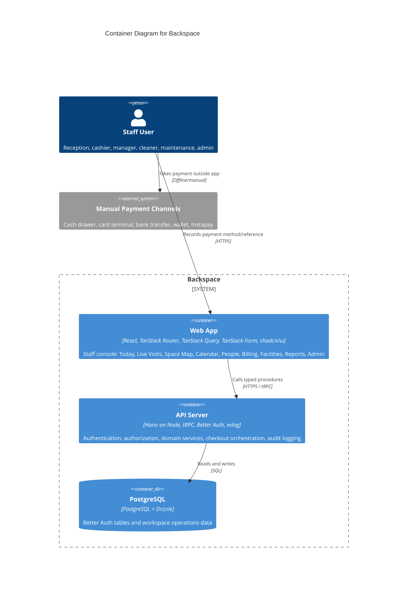

# Container Diagram - Backspace

> **C4 Level 2** - Backspace broken down into runnable units and owned data stores.

## Diagram

## Internal Package Boundaries

The diagram intentionally keeps only runnable containers and the data store. The monorepo also has internal packages:

- `packages/api` - tRPC routers, protected procedures, permission middleware, domain services, validation, money, audit.
- `packages/auth` - Better Auth setup with Drizzle adapter.
- `packages/db` - Drizzle schema, migrations, seed data, Postgres docker setup.
- `packages/env` - server/web environment schemas.
- `packages/ui` - shared shadcn/ui components and global styles.

## Design Constraints

- Do not add a new backend runtime or framework.
- Do not add a second API style unless a later AgDR explicitly approves it.
- Do not add payment-provider SDKs in v1.
- Keep business invariants in `packages/api` domain services, not only in UI components.

---

_Generated by `/c4`-style planning on 2026-06-23. Re-run after architecture changes._
