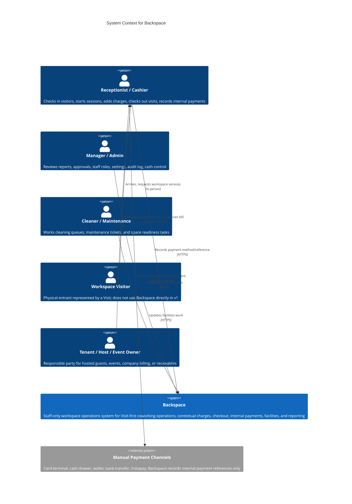

# System Context - Backspace

> **C4 Level 1** - the system and everyone/everything it talks to.

## Diagram

## Scope

Backspace v1 is internal and staff-operated. Visitors, tenants, hosts, and event attendees are domain participants but not direct application users.

## External Relationships

- **Manual Payment Channels** are explicitly not integrated. Backspace records method/reference/outcome only.
- **Better Auth** is an internal package/library integration in this monorepo, not a third-party hosted identity provider for this design.
- No email, SMS, payment provider, analytics, or deployment provider is in scope for the first planning cycle.

---

_Generated by `/c4`-style planning on 2026-06-23. Re-run after architecture changes._
