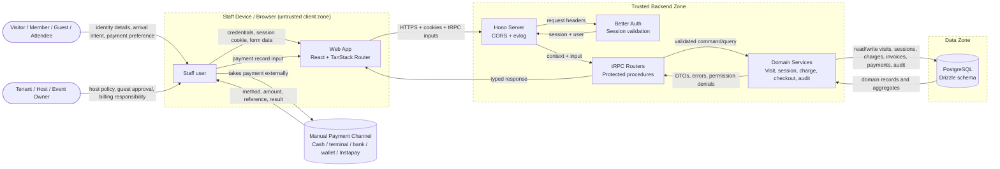

# Data Flow Diagram - Backspace Workspace Operations

> DFD for the staff-only Visit-first operations system. This is the input to future STRIDE and compliance checks.

## Diagram

## Trust boundaries

| From | To | Authentication mechanism | Data classification |
|------|----|--------------------------|---------------------|
| Visitor/host -> Staff | In-person handoff | Human identity/policy verification, not system auth | PII, booking/event context, billing responsibility |
| Staff -> Web App | Browser session | Better Auth session cookie after login | Credentials in flight, staff identity, operational form data |
| Web App -> Hono/tRPC | HTTPS + cookie + CORS | Better Auth session resolved server-side | PII, visit/session data, charge/payment inputs, branch context |
| Hono -> Better Auth | Internal server call | Trusted package call with request headers | Session token/cookie, user identity |
| tRPC -> Domain Services | In-process boundary | `protectedProcedure` + permission middleware | Validated command/query payloads |
| Domain Services -> PostgreSQL | SQL connection | DB credentials from server env | Highest sensitivity: auth tables, PII, billing, payments, audit logs |
| Staff -> Manual Payment Channel | Offline/manual action | External process outside Backspace | Payment amount, method, terminal/bank/reference details |
| Manual Payment Channel -> Staff -> Web App | Manual entry | Staff authenticated to Backspace | Internal payment reference; no stored card data |

## Data classifications

| Data | Classification | Source / Notes |
|------|----------------|----------------|
| Staff account/session | Credentials / internal | Better Auth session and user tables. |
| Person name, phone, email | PII | People search, quick create, membership/guest/event flows. |
| Visit and usage-session timestamps | Internal operational | Can reveal physical presence patterns. |
| Membership, tenant, host, event relationships | Internal / PII | Billing responsibility and access policy. |
| Charges, invoices, payments, shifts | Financial internal | No external card data; method/reference only. |
| Audit logs | Internal governance | Actor, action, entity, before/after, reason. |
| Space status, cleaning, maintenance | Internal operational | Workspace readiness and capacity. |
| Server env secrets | Secrets | `DATABASE_URL`, `BETTER_AUTH_SECRET`, CORS/auth URLs. |

## Notes

- No payment-provider API boundary exists in v1. If one is added later, this DFD must be redrawn and followed by a threat model.
- The browser is untrusted. Permission denials and business-rule conflicts must be computed server-side.
- PII and financial data should not be emitted into evlog or console logs beyond stable IDs and coarse status fields.
- Audit writes should happen inside the same transaction as sensitive mutations where feasible.

---

## References

- `projects/backspace/architecture/context.md`
- `projects/backspace/architecture/container.md`
- `projects/backspace/designs/workspace-operations-technical-design.md`
- Future input to `/threat-model backspace` after implementation stabilizes.

---

_Generated by `/dfd`-style planning on 2026-06-23. Re-run after trust-boundary or data-flow changes._
