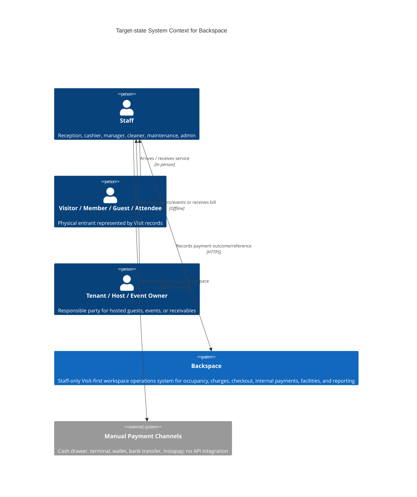

# Architecture Vision - Backspace

> Target-state architecture, current-to-target migration path, and explicit anti-scope for the Backspace workspace operations system.

## Scope

This vision covers the `zeyadsleem/backspace` managed project: a staff-only coworking/workspace operations system built inside the existing Better-T-Stack monorepo. It covers daily operations, Visit/Usage Session tracking, contextual charges, checkout, internal payments, facilities, reporting, permissions, and auditability.

It excludes customer-facing self-service, external payment processing, deployment platform setup, and any base-stack replacement.

---

## Principles

1. **Visit is the source of truth** - every physical entrant has a Visit, even when non-billable.
2. **No anonymous standalone POS** - every charge must attach to an operational target.
3. **Server rules are authoritative** - UI affordances help staff, but tRPC/domain services enforce invariants.
4. **Money uses integer minor units** - no floating-point money calculations.
5. **Finalized financial records are immutable** - corrections use adjustments, reversals, refunds, or credit-note style records.
6. **Branch and role scope are explicit** - staff actions require branch access and permission checks.
7. **Operational changes are auditable** - sensitive actions record actor, entity, reason, and before/after.
8. **Generated stack boundaries stay intact** - extend `apps/*` and `packages/*`; do not scaffold a replacement app.
9. **Physical state drives availability** - bookings, sessions, cleaning, maintenance, and blocked states must prevent invalid check-in.

---

## Target-state architecture

---

## Current state vs target state

| Dimension | Today | Target | Gap |
|-----------|-------|--------|-----|
| Product surface | Generated Better-T-Stack demo routes: login, dashboard, health check | Staff-only operations console | Replace demo surfaces with staff routes while preserving TanStack Router structure. |
| Domain model | Better Auth schema only | Workspace, people, memberships, bookings, visits, sessions, charges, invoices, payments, shifts, facilities, staff, audit | Add Drizzle schema modules and migrations. |
| Auth | Better Auth session support exists | Better Auth plus staff profile, role, branch access, permissions | Add additive authorization model and middleware. |
| API | Minimal tRPC router with health/privateData | Domain routers with thin procedures and server-side services | Add router modules, validation, permission middleware, domain services. |
| Money | No domain money logic | Integer minor-unit money helpers and tested billing splits | Add helpers and tests before billing flows. |
| Operations UX | Generated home/dashboard | Today, Live Visits, Space Map, Calendar, check-in drawers, add-charge, checkout | Build staff shell and route tree. |
| Facilities | Not represented | Cleaning queue, maintenance tickets, space status history | Add operations schema, services, and staff surfaces. |
| Audit | evlog middleware only | Domain audit log for sensitive mutations | Add audit table/writer and use from services. |
| Testing | `vp test` finds no tests at baseline | Unit/integration/router tests for core invariants | Establish test harness in domain foundation. |
| Deployment | Not configured | No deployment in v1 planning | Keep deployment out of initial ticket batch. |

---

## Migration path

| Phase | Milestone | Owner | Done when |
|-------|-----------|-------|-----------|
| Phase 0 | Planning and design package | Tech Lead / PM | PRD, project map, initiative, technical design, architecture docs, journey, and ticket batch exist. |
| Phase 1 | Domain foundation | Backend Engineer | Schema modules, enums, seeds, money, permissions, audit, and tests cover core scenarios. |
| Phase 2 | Staff shell | Frontend Engineer | Protected app shell, navigation, branch selector, shift badge, quick actions, PermissionGate exist. |
| Phase 3 | Operations MVP | Full-stack | Visit, session, check-in, live visits, space map, add-charge, and basic checkout run against server rules. |
| Phase 4 | Billing foundation | Backend/Frontend | Responsibility split, invoices, payments, shifts, immutability, and corrections work. |
| Phase 5 | People, tenants, events | Full-stack | Memberships, tenants/hosts, guests, events, attendees, and billing modes are represented. |
| Phase 6 | Facilities and inventory | Full-stack | Catalog, inventory movements, cleaning tasks, and maintenance-blocked spaces integrate with operations. |
| Phase 7 | Reports and admin | Full-stack | Reports, settings, staff roles, approvals, and audit log support manager oversight. |

---

## Things we explicitly chose NOT to build

- **New scaffold / replacement app** - Rationale: the project already exists and was generated with the required stack. Reconsider only if the repository is intentionally replaced, which is out of scope.
- **Standalone anonymous POS** - Rationale: it breaks operational traceability. Reconsider only if the product introduces a separate retail counter flow with its own audit and visit-shortcut model.
- **External payment provider integration** - Rationale: v1 records internal payment methods and references only. Reconsider when online/customer-side payments become a product requirement.
- **Customer portal** - Rationale: first release is staff-only operations. Reconsider after staff workflows are stable and customer self-service has a dedicated PRD.
- **Microservice split** - Rationale: the current scale is better served by the generated monorepo and modular packages. Reconsider when independent deployability becomes a real operational bottleneck.
- **Deployment platform work** - Rationale: the user explicitly selected no web/server deploy target. Reconsider after the domain MVP is runnable and deployment requirements are known.

---

## Review cadence

Review this vision after each implementation phase and at least quarterly. A review should check whether the Visit-first model still holds, whether anti-scope triggers changed, and whether new domain decisions require AgDRs.

---

## References

- `projects/backspace/prd.md`
- `projects/backspace/PROJECT_MAP.md`
- `projects/backspace/designs/workspace-operations-technical-design.md`
- `projects/backspace/initiatives/workspace-operations-management.md`

---

_Generated by `/tech-vision`-style planning on 2026-06-23. Re-run quarterly or after significant architecture decisions._
