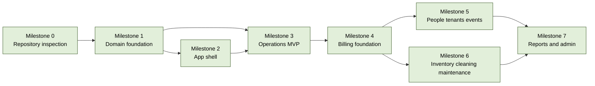

# Initiative: Workspace Operations Management

**Status**: Filed / In Progress
**Scope**: per-project (`backspace`)
**Quarter / Timeframe**: TBD after ticket sizing
**Owner**: TBD
**Created**: 2026-06-23
**Last Updated**: 2026-06-23

---

## Goal

Build a staff-only operations console that makes Visit-based coworking operations, space usage, contextual charges, checkout, internal payments, facilities work, reporting, and auditability reliable inside the existing Backspace stack.

## Success Criterion

Backspace can run the seeded scenarios for walk-in visitor, active member, booking customer, hosted guest, event attendee, unpaid checkout, out-of-stock item, maintenance-blocked space, and cleaning-required space without standalone POS or external payments.

## Scope Decision

This initiative is scoped as **per-project** because it belongs to the `zeyadsleem/backspace` application and extends its existing Better-T-Stack monorepo. ApexYard artefacts live in `projects/backspace`, while implementation work belongs in `workspace/backspace` and the GitHub tracker for `zeyadsleem/backspace`.

---

## Dependency Graph

Legend: filed = green; unfiled = yellow; cancelled = red dashed.

Filed tracker scope: parent [#3](https://github.com/zeyadsleem/backspace/issues/3), implementation issues [#4](https://github.com/zeyadsleem/backspace/issues/4)-[#20](https://github.com/zeyadsleem/backspace/issues/20). Issue #4 was completed by PR [#21](https://github.com/zeyadsleem/backspace/pull/21); remaining implementation issues should proceed one at a time.

## Recommended Sequence

Topologically sorted over the DAG above; ties broken by value x risk-inverse.

1. **Repository inspection** - no inbound deps; value High, risk Low.
2. **Domain foundation** - depends on repository inspection; value High, risk High.
3. **App shell** - depends on domain foundation; value Medium, risk Medium.
4. **Operations MVP** - depends on domain foundation and app shell; value High, risk High.
5. **Billing foundation** - depends on Operations MVP; value High, risk High.
6. **People, tenants, events** - depends on Billing foundation; value Medium, risk Medium.
7. **Inventory, cleaning, maintenance** - depends on Billing foundation; value Medium, risk Medium.
8. **Reports and admin** - depends on people/tenants/events and facilities work; value Medium, risk Medium.

Sequence rationale: repository inspection is already complete for planning. Domain foundation must land before UI or billing so server rules, schema, permissions, and seed data are not duplicated in screens. Operations MVP precedes billing because checkout depends on visits, sessions, charges, and space state. People/tenants/events and inventory/facilities can proceed after billing foundations exist, then reports/admin consolidate cross-domain data.

---

## Milestones

### Milestone 0 - Repository inspection

**Status**: done for planning
**Filing**: Covered by parent [#3](https://github.com/zeyadsleem/backspace/issues/3) and planning artefacts.

- **Success criterion**: Better-T-Stack structure, scripts, DB, auth, tRPC, routes, env, Docker, and shadcn locations are documented.
- **Blocks**: Domain foundation.
- **Blocked by**: none.
- **Kill criterion**: Cancel only if the repository is replaced, which is explicitly out of scope.
- **Value**: High.
- **Risk**: Low.
- **Confidence in time estimate**: High.

Inspection findings are captured in `PROJECT_MAP.md`. No app scaffold or stack replacement is required.

### Milestone 1 - Domain foundation

**Status**: filed / partly complete
**Filing**: Filed as [#4](https://github.com/zeyadsleem/backspace/issues/4), [#5](https://github.com/zeyadsleem/backspace/issues/5), [#6](https://github.com/zeyadsleem/backspace/issues/6), [#7](https://github.com/zeyadsleem/backspace/issues/7). Issue #4 is complete via PR [#21](https://github.com/zeyadsleem/backspace/pull/21).

- **Success criterion**: Database schema, shared enums/constants, Zod schemas, money helper, permission helper, audit helper, and seed data cover the requested operational scenarios.
- **Blocks**: App shell, Operations MVP.
- **Blocked by**: Repository inspection.
- **Kill criterion**: Cancel if the product model stops being Visit-first.
- **Value**: High.
- **Risk**: High.
- **Confidence in time estimate**: Medium.

This milestone creates the durable server-side model: branches, spaces, people, accounts, memberships, bookings, visits, sessions, events, charges, invoices, payments, shifts, cleaning, maintenance, staff roles, approvals, and audit logs. It also establishes server-enforced invariants for money, permissions, invoice immutability, shifts, and double booking. Rich UI support begins here by returning precise domain errors/reason codes and seeding realistic operational states for future forms, tables, drawers, reports, and state transitions.

### Milestone 2 - App shell

**Status**: filed
**Filing**: Filed as [#8](https://github.com/zeyadsleem/backspace/issues/8).

- **Success criterion**: Staff console shell provides sidebar groups, topbar, branch selector, shift badge, global search shell, quick actions, current user menu, and PermissionGate.
- **Blocks**: Operations MVP.
- **Blocked by**: Domain foundation.
- **Kill criterion**: Cancel if a non-staff UI becomes the immediate product direction.
- **Value**: Medium.
- **Risk**: Medium.
- **Confidence in time estimate**: Medium.

This milestone shapes the UI frame without replacing TanStack Router or generated routing conventions. It uses existing shadcn/ui components first and keeps frequent staff actions fast. `cmdk` and `motion` are allowed only if they serve real command/search and purposeful transition workflows.

### Milestone 3 - Operations MVP

**Status**: filed
**Filing**: Filed as [#9](https://github.com/zeyadsleem/backspace/issues/9), [#10](https://github.com/zeyadsleem/backspace/issues/10), [#11](https://github.com/zeyadsleem/backspace/issues/11), [#12](https://github.com/zeyadsleem/backspace/issues/12), [#13](https://github.com/zeyadsleem/backspace/issues/13), [#14](https://github.com/zeyadsleem/backspace/issues/14).

- **Success criterion**: Staff can run walk-in, member, booking, hosted guest, event attendee, non-billable visit, add-charge, checkout, and space map workflows against server-side rules.
- **Blocks**: Billing foundation.
- **Blocked by**: Domain foundation, App shell.
- **Kill criterion**: Cancel if Visit is no longer the operational source of truth.
- **Value**: High.
- **Risk**: High.
- **Confidence in time estimate**: Medium.

This milestone delivers Today, Live Visits, Space Map, Check-in Queue, New Visit, Visit Details, Add Charge, and Checkout surfaces. It keeps POS-like activity attached to operational targets. Forms should use TanStack Form/Zod where complex; dense lists should use `@tanstack/react-table` when table behavior is central; command/search, motion, and empty/success states remain gated by issue-specific need.

### Milestone 4 - Billing foundation

**Status**: filed
**Filing**: Filed as [#14](https://github.com/zeyadsleem/backspace/issues/14) and [#15](https://github.com/zeyadsleem/backspace/issues/15).

- **Success criterion**: Checkout can generate invoices, split billing responsibility, record internal payments, enforce open-shift cash, and preserve paid-invoice immutability.
- **Blocks**: People tenants events, Inventory cleaning maintenance.
- **Blocked by**: Operations MVP.
- **Kill criterion**: Cancel if external payment provider integration becomes required immediately, which is currently out of scope.
- **Value**: High.
- **Risk**: High.
- **Confidence in time estimate**: Medium.

This milestone includes Open Bills, Invoices, Payments, Shifts, payment methods, pay-later and host-account handling, refunds/reversals, and cash-control workflows. Checkout should be visually clear but calm: responsibility split, zero-due/included/complimentary/pay-later states, stale preview conflicts, and space-state consequences must be explicit.

### Milestone 5 - People, tenants, events

**Status**: filed
**Filing**: Filed as [#16](https://github.com/zeyadsleem/backspace/issues/16), [#17](https://github.com/zeyadsleem/backspace/issues/17), and [#18](https://github.com/zeyadsleem/backspace/issues/18).

- **Success criterion**: People, memberships, tenants/hosts, hosted guests, events, and attendees are represented in UI and API workflows.
- **Blocks**: Reports and admin.
- **Blocked by**: Billing foundation.
- **Kill criterion**: Cancel if MVP narrows to walk-ins only.
- **Value**: Medium.
- **Risk**: Medium.
- **Confidence in time estimate**: Medium.

This milestone expands operational coverage beyond walk-ins to members, host-paid guests, companies, event hosts, attendees, and membership coverage. People/member/tenant/event screens should be operational records with visit history, membership state, billing responsibility, hosted guest policy, and attendee state, not generic CRM pages.

### Milestone 6 - Inventory, cleaning, maintenance

**Status**: filed
**Filing**: Filed as [#19](https://github.com/zeyadsleem/backspace/issues/19).

- **Success criterion**: Catalog, inventory movement, cleaning queue, and maintenance tickets support add-on availability and space readiness.
- **Blocks**: Reports and admin.
- **Blocked by**: Billing foundation.
- **Kill criterion**: Cancel if facilities operations are managed outside Backspace for the first release.
- **Value**: Medium.
- **Risk**: Medium.
- **Confidence in time estimate**: Medium.

This milestone connects stock products and services to Charges and ensures spaces can move through cleaning, maintenance, blocked, and available states. `@dnd-kit/*` is allowed only for real reorder or assignment workflows, such as cleaning priority or task assignment.

### Milestone 7 - Reports and admin

**Status**: filed
**Filing**: Filed as [#20](https://github.com/zeyadsleem/backspace/issues/20), with staff roles/settings also connected to [#5](https://github.com/zeyadsleem/backspace/issues/5).

- **Success criterion**: Daily, occupancy, and revenue reports plus staff roles, settings, and audit log screens support manager/admin oversight.
- **Blocks**: none.
- **Blocked by**: People tenants events, Inventory cleaning maintenance.
- **Kill criterion**: Cancel if reporting is deferred after operations launch.
- **Value**: Medium.
- **Risk**: Medium.
- **Confidence in time estimate**: Medium.

This milestone makes the system governable: role configuration, sensitive action review, audit timeline, daily close visibility, occupancy trends, and receivables reporting. `@tanstack/react-table` and `recharts` are allowed when they answer real audit/reporting questions; vanity charts and hero metrics are out of scope.

---

## Open Uncertainties

- **Domain foundation - inventory timing**: Decide whether stock movement happens at charge finalization or invoice finalization.
- **Billing foundation - discount threshold**: Decide threshold requiring supervisor approval.
- **Billing foundation - event settlement**: Decide event invoice representation.
- **Operations MVP - Quick Sale Visit**: Decide if a minimal visit shortcut is allowed for rare true quick sales.

---

## Anti-Scope

- New app scaffold.
- Next.js or any replacement full-stack framework.
- Replacement of Hono, tRPC, Better Auth, Drizzle, PostgreSQL, pnpm, Vite+, Tailwind, or shadcn/ui.
- External payment provider.
- Customer-facing portal.
- Standalone anonymous POS as the normal daily workflow.
- Decorative UI libraries/effects without operational need, including marketing motion, 3D/parallax, carousel-heavy surfaces, vanity charts, and drag/drop that does not represent real prioritization or assignment.

---

## Re-run History

| Date | Delta |
|------|-------|
| 2026-06-23 | Initial creation - 8 milestones, scope=per-project |
| 2026-06-23 | Filed parent #3 and implementation issues #4-#20; synchronized milestones with filed issues and rich interaction/tooling policy. |
