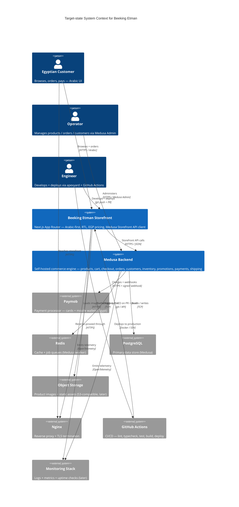

<!-- Source: extracted from projects/beeking-etman/foundation.md (v1, 2026-06-04). Re-run /tech-vision beeking-etman quarterly (refresh mode `r`) to keep aligned. -->

# Architecture Vision — Beeking Etman

> **North-star architecture** for the Beeking Etman Arabic-first e-commerce platform. Target-state + current-vs-target + migration path + anti-scope. Comprehensive project scope (MVP, payments, SEO, quality, security) lives at [`../foundation.md`](../foundation.md). This file is the **architecture-level** vision only.
>
> **Audience:** tech leads, head of engineering, the CTO. Reviewed **quarterly** (see § Review cadence).
>
> **Authoring note:** extracted from `foundation.md` v1 (2026-06-04). The recommended re-authoring path is `/tech-vision beeking-etman` — the interactive interviewer will structure the refresh without overwriting decisions that haven't changed.

## Scope

Covers the **Arabic-first customer-facing e-commerce platform** for the Egyptian market — the storefront experience (browse → cart → checkout → order history → account) and the underlying commerce / payment / shipping integrations. **Excludes** the Medusa Admin (consumed as-is for v1, no customisation), internal tooling, and any future marketplace / multi-vendor / mobile-app scope (see § "Things we explicitly chose NOT to build"). One vision, one system, one domain.

---

## Principles

1. **Commerce comes from Medusa** — no custom cart, checkout, order, inventory, pricing, discount, or customer logic. The storefront is a Medusa client. Custom code only where it adds business value.
2. **The primary repo is `beeking-etman`** — Medusa Admin, `medusajs/dtc-starter`, and `Blazity/next-enterprise` are reference material. In a conflict, the primary repo wins.
3. **Arabic + RTL first** — every UI component, validation message, email, SEO tag, and slug is Arabic-first and full-RTL. English support is a future additive without rebuild.
4. **Self-hosted by design** — no Medusa Cloud, no SaaS dependency. PostgreSQL + Redis + Docker + Nginx on Ubuntu is the target runtime. Hosting-portable.
5. **Reuse before build** — if Medusa provides it, use it. Custom code is for Egyptian-specific concerns: governorate shipping, EGP pricing, Paymob, COD, Arabic UX, Arabic SEO.
6. **No card data on the system** — Paymob (and any future provider) handles card processing. Backend holds only the secrets needed to call the provider's API; webhooks verify signatures.
7. **TypeScript strict, everywhere** — no implicit `any`, no `// @ts-ignore`. Strict-typed boundaries at every storefront ↔ Medusa call (TypeScript SDK + zod validation at trust boundaries).
8. **Stateless compute, stateful storage** — Next.js storefront is restart-safe; durable state lives in PostgreSQL, Redis, and (later) object storage. No local-filesystem state.
9. **No AI in the product** — no chatbot, recommendations, search-re-ranking, content generation, or customer-support agent shipped to end users. AI is out of v1 scope and is a separate decision each time it comes up.
10. **Apexyard is the methodology, not the product** — planning, docs, code review, release flow. None of it ships to customers.

---

## Target-state architecture

Replace placeholders with the **target** state. The customer-facing system boundary is the **storefront**. The Medusa backend is a separate system inside the same ownership. The Medusa Admin is an operator-facing system consumed as-is (no customisation in v1).

---

## Current state vs target state

| Dimension | Today | Target | Gap |
|---|---|---|---|
| Storefront code | Next.js Enterprise boilerplate, mostly un-customised | Arabic-first storefront wired to Medusa Storefront API with full RTL, EGP pricing, Egyptian shipping, Arabic SEO | Localise the boilerplate; build storefront API client; design system; SEO; checkout; account area |
| **Repo structure** | **Flat single Next.js app (`next-enterprise` boilerplate, no workspaces, no shared packages)** | **pnpm-workspaces monorepo: `apps/storefront` + `apps/backend` + `packages/{ui,config,shared}` (per [AgDR-0001](https://github.com/zeyadsleem/beeking-etman/blob/main/docs/agdr/AgDR-0001-monorepo-architecture.md))** | **Restructure: move next-enterprise tree into `apps/storefront/`; set up pnpm workspaces config; add `apps/backend` (Medusa); add shared packages; update CI/CD; update Docker; split LICENSE (MIT + AGPL-3.0)** |
| Commerce engine | None | Self-hosted Medusa backend with Paymob + COD + governorate shipping | Stand up `apps/backend` Medusa project; configure modules; integrate payment + shipping providers |
| Database | None | PostgreSQL (Medusa primary store) | Provision; schema migrations; backup strategy |
| Cache + jobs | None | Redis (Medusa cache + job queue) | Provision |
| Payments | None | Paymob (cards + wallets) + COD | Implement Paymob plugin in Medusa; wire webhooks; COD as a manual capture method |
| Shipping | None | Governorate-based pricing + free-shipping threshold | Configure Medusa shipping zones + price lists for Egyptian governorates |
| Deployment | Local dev only | Self-hosted on Ubuntu + Docker + Nginx + SSL | Dockerfile per service; docker-compose for local; deployment scripts / Ansible for VPS; GitHub Actions CI/CD |
| Observability | None | Structured logs + error tracking + uptime | OpenTelemetry instrumentation (already in boilerplate); add error tracking; set up alerts later |
| Admin | None | Medusa Admin (v1) | Use the default Medusa Admin; no custom dashboard in v1 |
| CI/CD | None | GitHub Actions: lint → typecheck → test → build → deploy | Add workflow files; require green checks on PR |
| L10n | None | Arabic-first; full RTL; EGP currency; English-ready | next-intl or similar; tokenise all strings; currency formatter; number formatter |
| AI features | None | None (explicit non-goal) | None — keep AI as a separate decision per requirement |

---

## Migration path

Multi-quarter milestones. Each is verifiable ("by Q-end, X works") and sized to deliver inside a single quarter without freezing other work.

| Quarter | Milestone | Owner | Done when |
|---|---|---|---|
| Q3 26 | Repo bootstrap + Medusa local + monorepo skeleton | Tech Lead | `apps/backend` (Medusa) + `apps/storefront` (Next.js) both run locally via docker-compose; PostgreSQL + Redis up; storefront hits Medusa `/store/products` and renders an Arabic product list |
| Q4 26 | Arabic storefront MVP — browse, product details, cart | Tech Lead + Frontend | Arabic + RTL UI live on real Medusa products; design system in Storybook; readable slugs; basic SEO meta; responsive mobile-first |
| Q1 27 | Checkout + Payments (COD + Paymob) + Egyptian shipping | Tech Lead + Backend | Checkout completes a real order end-to-end on staging; Paymob card payment works in test mode; COD captured; governorate shipping prices apply; order appears in Medusa Admin |
| Q2 27 | Customer accounts + order history + emails + production deploy | Tech Lead + Platform | Customer can register / login / view order history; Arabic transactional emails sent; production on VPS with HTTPS, backups, basic monitoring |
| Q3 27 | (Buffer / hardening) | Tech Lead | Bug-fix week, performance pass, /launch-check, security review, accessibility audit; remove anything not in v1 scope |

Group dependent milestones only if both can be funded in parallel. If a milestone slips, the **vision** doesn't change — only the date does. This table is the canonical planning surface; re-evaluate at every quarterly review.

---

## Things we explicitly chose NOT to build

This is the load-bearing section. Every item below was considered and consciously declined, with a "reconsider when" trigger so the next person to suggest it knows the rationale.

- **Custom cart engine** — *Rationale:* Medusa already owns cart. Re-implementing adds risk + maintenance for zero business value. *Reconsider when:* never (Medusa cart is the cart).
- **Custom order / inventory / pricing / discount logic** — *Rationale:* Medusa owns all of it; "re-build it ourselves" was explicitly rejected in the project foundation. *Reconsider when:* never.
- **Custom admin dashboard in v1** — *Rationale:* Medusa Admin ships and covers every v1 admin need. A custom admin in v1 is months of work with no business value. *Reconsider when:* a v2 admin requirement is named that Medusa Admin genuinely cannot satisfy.
- **Medusa Cloud** — *Rationale:* cost, data ownership, customization freedom, hosting-portability. Self-hosting is the project direction. *Reconsider when:* the operational cost of self-hosting (DBA time, incident response) exceeds the Medusa Cloud subscription cost AND the team doesn't need full infra control.
- **Marketplace / multi-vendor** — *Rationale:* out of v1 scope; adds seller onboarding, payouts, dispute flows, seller analytics. *Reconsider when:* business explicitly opens a marketplace line.
- **Mobile app** — *Rationale:* the responsive storefront is the v1 mobile surface. A native app is significant work for unknown return. *Reconsider when:* mobile conversion shows a clear gap that responsive web can't close.
- **AI features in the product (chatbot, search, recommendations, support agent, content generation, personalization)** — *Rationale:* explicit non-goal in the project foundation. AI in the product is a separate decision each time it comes up. *Reconsider when:* a specific AI feature is requested with a clear success metric AND a clear cost-of-mistake. Until then, no AI ships to end users.
- **Multi-region active-active** — *Rationale:* Egypt-first. Single-region deployment is sufficient and simpler. *Reconsider when:* expansion lands in a second geographic region with cross-region data-residency requirements.
- **GraphQL gateway in front of Medusa REST** — *Rationale:* aggregator complexity exceeds the over-fetching cost saved. Medusa Store API is REST; Next.js Server Components cache per request. *Reconsider when:* ≥ 3 client surfaces with materially different field needs.
- **Microservices below the bounded-context level** — *Rationale:* a 10-service monolith-of-microservices is more painful than a well-bounded modular monolith at our scale. *Reconsider when:* org > 50 engineers OR a single bounded context's deploy frequency demands per-service independence.
- **Custom OIDC provider** — *Rationale:* identity is not a differentiator; vendor lock-in is acceptable. *Reconsider when:* a vendor exit event.
- **Loyalty system, advanced ERP integration, advanced analytics** — *Rationale:* out of v1 scope. *Reconsider when:* v2 scope is planned and these are explicitly included.
- **Fawry / bank transfer / wallets in v1** — *Rationale:* COD + Paymob covers the v1 payment surface. *Reconsider when:* market research shows a specific payment method is a measurable conversion blocker.

The "reconsider when" clause is load-bearing — it prevents the section from rotting into "this was forbidden in 2026 and the rationale is lost".

---

## Review cadence

This vision is reviewed **quarterly** (Tech Lead + Head of Engineering + at least one engineer who has shipped against the current state). The review checks:

- Have the migration milestones from the previous quarter shipped? If not, what blocked them?
- Does the target state still match the business direction, or has the business shifted?
- Has anything in "Things we explicitly chose NOT to build" hit its "reconsider when" trigger?
- Are there new gaps to surface in the current-vs-target table?

A quarterly review that produces zero changes is fine — it's still a record that the vision was checked and remains valid. Re-run `/tech-vision beeking-etman` with the `r` (refresh) option to preserve unchanged sections and update the rest.

---

## References

- [`../foundation.md`](../foundation.md) — comprehensive project spec (MVP, payments, SEO, security, quality)
- [`../README.md`](../README.md) — project overview, owners, tech stack, links
- Medusa Documentation — https://docs.medusajs.com
- Next.js Enterprise Boilerplate — https://github.com/Blazity/next-enterprise
- Medusa DTC Starter — https://github.com/medusajs/dtc-starter
- AgDR-0003 (Mermaid C4 for diagrams) — why every architecture diagram in apexyard is Mermaid
