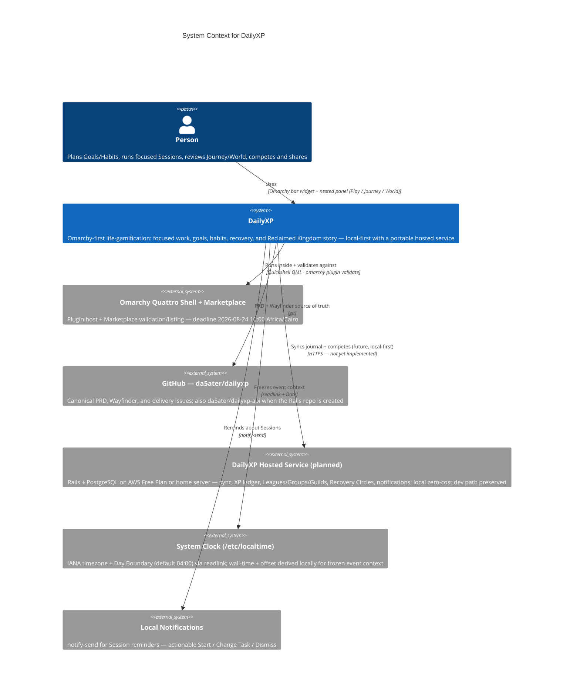

<!-- Source: ApexYard · templates/architecture/c4-context.md · github.com/me2resh/apexyard · MIT -->
<!-- Wayfinder-grounded for DailyXP: single Person, Omarchy host, future Rails host, no fabricated externals -->

# System Context — DailyXP

> **C4 Level 1** — the system and everyone/everything it talks to. Grounded in `docs/design/dailyxp-v1.md` § Primary experience + Wayfinder `repository-topology.md`.

> **Note**: auto-generated by /handover on 2026-08-21 from the Wayfinder + PRD. Refine when `da5ater/dailyxp-api` lands or the AWS/home-server decision (#13, 2026-10-20) resolves.

## Diagram

## How to use this template

1. This file lives at `projects/dailyxp/architecture/context.md` (portfolio docs). In-repo mirror: `docs/architecture/context.md`.
2. Replaces the generic `{Project Name}` + Auth0/Stripe/Postmark placeholders with DailyXP's real externals. No payment processor is involved — DailyXP is free, no purchasable advantage.
3. Remove `hosted` if you want a strict as-is L1 (plugin-only today); keep it dashed-by-intent if you want the roadmap visible in context.
4. Keep it one screen tall. Deeper deployable units belong in `container.md`.
5. Commit. GitHub renders the diagram inline.

## What goes in L1 (context)

- The system (one box: DailyXP)
- People (single `Person` — the person using DailyXP; no admin role in V1)
- External systems DailyXP actually talks to (Omarchy host/Marketplace, GitHub, the future hosted service, system clock, local notifications)
- Arrows with direction + gist (`Runs inside`, `Syncs journal`, `Freezes event context`)

## What does NOT go in L1

- Internal containers (BarWidget / Panel / StateStore) — that's `container.md`.
- Deployment topology (AWS vs home server, EC2 vs bare metal, regions) — deferred to `vision.md` + issue #13.
- Payment/auth providers (Auth0, Stripe) — DailyXP is free and local-first; auth/sync design is not yet settled.

## Maintenance

Update maybe once or twice a year — when an external relationship changes (new hosted service, new platform client beyond Omarchy, new external integration). If it churns every sprint, L2 detail has leaked into L1.

## References

- [C4 Model — Level 1](https://c4model.com/diagrams/system-context)
- [Mermaid C4 syntax](https://mermaid.js.org/syntax/c4.html)
- DailyXP V1 PRD: `docs/design/dailyxp-v1.md`
- Wayfinder: `.scratch/wayfinder/map.md`
- ApexYard's own L1: `docs/architecture/apexyard-context.md`
