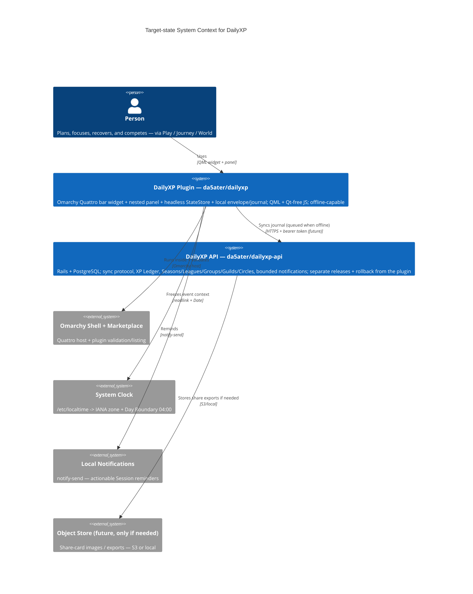

<!-- Source: ApexYard · templates/architecture/vision.md · github.com/me2resh/apexyard · MIT -->
<!-- Wayfinder-grounded for DailyXP: wayfinder/map.md + accepted-contract + aws-zero-spend + repository-topology + V1 PRD -->

# Architecture Vision — DailyXP

> **North-star architecture** for DailyXP — the Omarchy-first life-gamification product (focused work, Goals/Habits/Recovery, Reclaimed Kingdom story, Seasons/Leagues competition). The vision that the V1 PRD (`docs/design/dailyxp-v1.md`, 1036 lines, Status: Revised) and the Wayfinder map expect to become executable tickets without unresolved product, privacy, platform, or zero-spend decisions.

## Scope

Covers the **DailyXP product system** — the Omarchy Quattro plugin (BarWidget + Panel + StateStore + EventModel journal + local envelope at `$XDG_STATE_HOME/dailyxp/`) and its future hosted companion `da5ater/dailyxp-api` (Rails + PostgreSQL sync, XP Ledger, Leagues/Groups/Guilds, Recovery Circles, notifications). Excludes a native non-Omarchy desktop rewrite or a second plugin backend beyond the `dailyxp` / `dailyxp-api` two-repo topology — those are future destinations the portable contracts already anticipate. This vision is needed now because the Wayfinder still lists unresolved persistence/sync, navigation/accessibility, and operational after-service-boundaries questions; the migration path below turns each into a horizon rather than a hidden assumption.

## Principles

1. **Local first, sync later** — record locally, respond immediately, sync when connected; a person must be useful without an account or network (PRD principle 1).
2. **Portable contracts over platform lock-in** — EventModel stays Qt-free, sync protocol stays platform-neutral, hosted Rails can move AWS → home server without a product rewrite.
3. **Frozen time, deterministic replay** — every event freezes UTC + IANA zone + offset + Day Boundary; projection rebuild never consults the current clock (DST/Boundary changes cannot move history).
4. **Permanent earned progress** — Momentum may fall, Lifetime XP / Levels / Story Ranks / Achievements / Provinces never do; the Hollow King may occupy only unfinished territory.
5. **Sensitive by design** — Recovery Tracks are start/ongoing/relapse events, never ordinary Habits; no Recovery data becomes public implicitly; global/country/region Recovery Leagues are opt-in + category-moderated.
6. **Cheapest efficient design** — every AWS/hosting call asks "can this be cheaper without losing required efficiency, reliability, or behavior?" (AGENTS.md); Free Plan is the hard boundary (issue #13, re-audit 2026-10-20).
7. **Honest releases** — ship a polished competition build before full V1; no fake social data, unavailable buttons, or unsupportable availability claims; Single-AZ acknowledged (PRD non-goal: no high availability in V1).
8. **Idempotency + atomic durability** — `append` idempotent by `eventId`, canonical export byte-identical, primary/backup envelope with generation + checksum, torn writes preserve a whole generation.

## Target-state architecture

The target keeps the local plugin as the source of truth for intent (record locally, respond immediately) and the hosted Rails service as the steward for competition, ranking, and cross-device sync — linked by a sync protocol that degrades gracefully to offline. Current state (today) is the left side only; the `api` box is the horizon tracked below.

For container topology as-is, see `container.md`; for trust boundaries that feed threat modelling, see `dfd.md`.

## Current state vs target state

| Dimension | Today | Target | Gap |
|-----------|-------|--------|-----|
| **Data layer** | Flat JS models at repo root + filesystem envelope (primary/backup + canonical journal); no DB; 137 `node --test` green, no coverage threshold | `da5ater/dailyxp` retains local envelope as primary; `da5ater/dailyxp-api` owns PostgreSQL (Single-AZ in V1, acknowledged) for Goals/Milestones/Tasks/Sessions/Habits/Recovery/XP/Seasons/Groups; local journal syncs as the canonical source; sync protocol versioned | Create `dailyxp-api` repo via `/handover`; design sync protocol + EventModel projection for server; decide schema ownership per bounded context (no cross-context joins) |
| **Sync protocol** | None — local-only | Local-first queued sync: append locally, push to `dailyxp-api` when connected, pull rankings/notifications; idempotent by `eventId`; Recovery sharing is opt-in-gated | Design + spec sync (push/pull, conflict when offline edits span devices, Recovery privacy gates, `occurrenceKey` identity) |
| **Auth** | No auth (local-only device access) | Bearer token from Rails (local-first anonymous use still allowed); explicit consent for geo/identity in Leagues | Add auth to `dailyxp-api`; keep anonymous local use; consent-gated Leagues |
| **Deployment** | `omarchy plugin add --enable` + `omarchy-shell rescanPlugins`; manual `qmllint` + `node --test`; no CI | Plugin CI (QML lint + JS tests + coverage) on every PR; `dailyxp-api` CI (lint/typecheck/test/build) + Marketplace packaging evidence; throttled local-first public-alpha per `aws-zero-spend` | Adapt `golden-paths/pipelines/ci.yml` to `node --test` + `qmllint` (tolerant `qs.*` imports); add `qmllint` CI job for Omarchy checkout |
| **Observability** | None | Plugin: local logs + actionable envelope/journal errors (already); hosted: structured logs + one synthetic check before leaving staging; no dashboard requirement for pre-zero-spend alpha | Pick cheapest stack in `/decide` (Sentry vs CloudWatch vs self-hosted) before first `dailyxp-api` deploy; keep local zero-cost dev path |
| **Frontend** | QML `BarWidget.qml` + `Panel.qml` + `StateStore.qml` (QtQuick/Quickshell, `qs.Commons`/`qs.Ui`); no HTML SPA | Same QML surfaces + native non-Omarchy clients later (portable contracts already); PWA/web considered only if Omarchy Marketplace competition requires a web story | Preserve Qt-free `EventModel.js` for cross-client reuse; no rewrite decision until post-competition |
| **Secrets management** | No secrets in repo (verified: no `.env`, no credential literals) | Rails secrets via AWS Secrets Manager or env with IAM-scoped reads (pick cheapest); no `.env` in deploy bundles | Royal/spec adoption + security traceability (`sreecurity` notes during hosted adoption) |
| **Hosting** | No hosted infra | Wayfinder topology: AWS Free Plan hard boundary (USD 158.07 → 2027-01-28, us-east-1) OR home server; throttled local-first alpha; credits ≠ spend auth; issue #13 re-audit 2026-10-20 | Keep zero-spend until re-audit; hosted milestone gated on Mohamed's explicit per-resource approval (AGENTS.md) |

## Migration path

Each milestone is concrete enough to verify and fits one quarter without freezing other work.

| Horizon | Milestone | Owner | Done when |
|---------|-----------|-------|-----------|
| **Q3 2026** | **Marketplace competition build** (PRD honest-release before full V1) | Tech Lead + Frontend | `omarchy plugin validate` + `qmllint` + `node --test` + coverage threshold all green in CI; Marketplace listing submitted before 2026-08-24 10:00 Africa/Cairo; competition buildtagged with evidence in `docs/release-evidence.md` — no fake data or unsupported production claims |
| **Q3→Q4 2026** | **Harnessability scaffolding** (while competition build is in review) | Tech Lead | ESLint baseline for JS + QML lint tolerant to missing `qs.*` imports in CI; coverage gate committed; `block-git-add-all` / `validate-branch-name` / `pre-push-gate` live; Rex calibrated on the flat layout and demoted to advisory (harnessability `low` — flat + no types + weak framework opinionation) until scaffolding lands |
| **2026-10-20** | **Re-audit AWS vs home-server + sync posture** (issue #13) | Head of Engineering + SRE | Decision recorded as AgDR (hard-bound: cheapest efficient, Free Plan is the billing boundary); hosting + sync budget + local zero-cost dev path all documented; no chargeable AWS provision unless Mohamed says `merge`/approves per-resource |
| **Q4 2026** | **Adopt `da5ater/dailyxp-api` + spec the sync protocol** | Tech Lead + Backend + SRE | `dailyxp-api` registered via `/handover` as a separate repo; PRD-grounded sync AgDR (push/pull, idempotency key, offline queue, conflict rule, Recovery sharing gated by opt-in); `EventModel` test fixtures shared between plugin + Rails to prove the same replay |
| **Q1 2027** | **Competitive hosted alpha — throttled + priced for Free Plan** | Backend + Platform + SRE | Single-AZ PostgreSQL + throttled API deployed within Free Plan quotas; Seasons/Leagues/Groups/Guilds/Circles behind explicit consent; Recovery Circles privacy-gated; synthetic check; budgets + alerts + runbook + rollback proven in staging before prod; local-only flow stays useful without an account |

## Things we explicitly chose NOT to build (anti-scope)

| Not building | Rationale | Reconsider when |
|--------------|-----------|-----------------|
| Native non-Omarchy clients (Linux beyond Omarchy, macOS, Windows) in V1 | First client is Omarchy; portable contracts already avoid lock-in; building every client now would delay the competition build and the sync protocol that all clients need | Post-competition, once `dailyxp-api` sync is stable and contract tests pass against a second client prototype |
| Rich comments / DMs / contact upload / precise location | PRD non-goals and sensitive-by-design posture; Recovery + habit data must not be exfiltrated; contact-upload would raise privacy/compliance load before moderation ops exist | Only with a dedicated safety + moderation + privacy review and operator headcount for moderation |
| Purchasable XP, ads, sale of data, paid Recovery | Product pays-against design: no purchasable advantage; monetisation before honest competition would violate the trust contract | Never for purchasable XP/power; revisit monetisation via cosmetic-only, non-competitive offers after V1 if needed |
| High-availability / multi-AZ in V1 | PRD non-goal: no high availability on a single app instance + Single-AZ DB; correct trade-off for Free Plan + home-server economics | When paid users and SLOs justify the cost — explicitly budgeted, not a default upgrade |
| Generated publishing automation (auto-publish `dailyxp` → distribution repo) | Wayfinder `repository-topology` decision: canonical monorepo/publishing split rejected in favour of two explicit repos (`dailyxp` + `dailyxp-api`) for simplicity and independent rollback | If a third repo forces copy-paste to three places — revisit with a proposal, not a side-effect |
| Fantasy Premier League branding/assets/trade dress | Legal and identity risk; DailyXP is its own kingdom mythology (Reclaimed Kingdom, Hollow King, Comeback Quests) | Never — original assets only |

## Review cadence

**Quarterly** — next review shortly after the **2026-10-20 hosting re-audit** (issue #13) and again after the **hosted alpha** ships in Q1 2027. Re-run `/tech-vision dailyxp` with `r` (refresh) to preserve this content as defaults and patch only changed sections. Also trigger a review any time a hosted-protocol, infra, or observability AgDR would invalidate a table row above.

---

_Generated by `/tech-vision` (via `/handover --all`) on 2026-08-21. Re-run quarterly (or after a significant architecture decision) — `/tech-vision dailyxp` with the `r` (refresh) option preserves the existing content as defaults._
