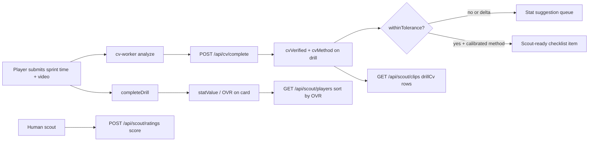

# Spike — Can KoraID “scout by AI” and assign a score?

**Date:** 2026-05-28  
**Owner:** Product / Engineering verification  
**Repos:** `Dr-kersho/koraid` (app), ops memo in `projects/koraid/`  
**Related:** [ADR-0002](https://github.com/Dr-kersho/koraid/blob/main/docs/adr/0002-scout-led-ratings-and-provenance.md), [cv-accuracy-literature](https://github.com/Dr-kersho/koraid/blob/main/docs/research/cv-accuracy-literature.md), [LAUNCH_STEP_SCOUT](https://github.com/Dr-kersho/koraid/blob/main/docs/LAUNCH_STEP_SCOUT.md)

---

## Question

Can we **scout players by AI** and output a **trusted scouting score** (for discovery, card, or scout workflow)?

---

## Verdict (go / no-go)

| Claim | Go? | Evidence |
|-------|-----|----------|
| **AI replaces human scout + gives scouting grade** | **NO** | ADR-0002: scouts are human; AI = clip tags / review queue |
| **AI verifies drill metrics from video (Pitch IQ)** | **YES (limited)** | `cv-worker` live; sprint/jump/agility analyzers run; gold passthrough blocked from scout-ready |
| **AI sets FIFA card OVR** | **NO (direct)** | OVR from `mergeDrillIntoProfile` → position-weighted stats after **self-reported** drill completion |
| **AI updates OVR after CV disagrees** | **ONLY if player accepts stat suggestion** | `maybeCreateStatSuggestionFromCvComplete` — suggestion, not auto-overwrite |
| **Human scout score in product** | **YES** | `POST /api/scout/ratings` — subjective event score + note |
| **Marketing: “scientifically verified sprint”** | **NO until 076** | Field calibration **0/40** trials on all drills (`npm run calibrate:field-status`) |

**Product go/no-go for “AI scout score”:** **Do not build or market it on current architecture.** Continue **human scout + AI drill verification + optional stat suggestions.**

---

## What we ran (this spike)

| Step | Result |
|------|--------|
| `pytest` in `services/cv-worker/tests/` | **9 passed** |
| `GET https://koraid-cv-worker.onrender.com/health` | **200** — `probe` + `analyze` mounted |
| Synthetic sprint MP4 → `analyze_drill_file` | AI **2.5s** vs user **3.2s**, confidence **0.47**, `withinTolerance: false`, method `opencv_motion_fallback` (toy video ≠ real sprint) |
| `npm run test:stat-suggest` | **4 passed** — suggestion when CV disagrees; skip when verified + zero delta |
| `npm run test:scout-search` | **4 passed** — sort by `overallRating` |
| `node scripts/spike-cv-scout-ovr-trace.mjs` | OVR **unchanged** after CV-only; scout-ready gate passes only with calibrated method + `withinTolerance` |

---

## Architecture trace (one sprint drill)



**Load-bearing code paths**

- OVR: `merge-drill-into-profile.ts` → `deriveOverallRating` / `derivePositionWeightedOverall` (`stat-engine.ts`)
- CV verify: `jobs.ts` `completeCvJob` → `applyCvResultToDrill` — sets `cvVerified`, does **not** re-merge stats
- Scout trust gate: `scout-ready-checklist.ts` — rejects `gold-mvp-passthrough`
- Human score: `event-ratings.ts` — `saveScoutEventRating({ score, note })`

---

## What “works today” for scouts

1. **Search** players by city, tier, position, OVR sort (`/scout/search`).
2. **Review** drill CV rows (AI time/height/metric, confidence, verified flag) on `/scout/clips`.
3. **Rate** the player themselves (`/api/scout/ratings`) — not AI-generated.
4. **Watchlist / contact** (MVP shipped; issues #43/#44 still open).

Pitch IQ helps scouts **trust or challenge self-reported drills**; it does **not** produce a composite “AI scout rating.”

---

## Accuracy / ops gaps

| Gap | Status | Blocker for |
|-----|--------|-------------|
| Field calibration N≥40 (076 sprint, 080 jump, …) | **0/8** ready | “Verified scientifically” copy |
| Real-phone sprint clip through prod worker | **Not run in spike** (needs `CV_WORKER_SECRET` + sample video) | Prod sign-off |
| Gold drill video analyzers | Partial; passthrough excluded from scout-ready | Full scout-ready gold CV |
| `launch:scout-e2e` on live `:3010` | **Not run** (needs dev server + seed data) | End-to-end scout UX smoke |

---

## Recommended next steps (ordered)

1. **Operator:** One real sprint upload on staging/prod → confirm `cvJobStatus=completed`, `cvMethod` ≠ passthrough, scout clips API shows row.
2. **Field:** Start **076** sprint calibration (40 trials) per `docs/research/calibration/FIELD-STUDY-RUNBOOK.md`.
3. **Product:** Close or narrow **#43/#44**; start **#37 Goals of the Week** — do **not** scope “AI scout score” without ADR revision.
4. **If AI scout is still desired later:** New ADR + separate model output (not OVR reuse); human-in-loop for minors and scout trust.

---

## Commands to replay

```bash
# App repo
cd ~/Documents/koraid
cd services/cv-worker && .venv/bin/python -m pytest tests/ -q
curl -s https://koraid-cv-worker.onrender.com/health
npm run test:stat-suggest
npm run calibrate:field-status
node scripts/spike-cv-scout-ovr-trace.mjs

# With secret + clip (operator)
CV_WORKER_URL=https://koraid-cv-worker.onrender.com \
CV_WORKER_SECRET='…' \
npm run calibrate:online-probe -- --remote --analyze-only
```

---

*Spike complete — no code change required for “no AI scout score”; CV verification path is real but gated.*
