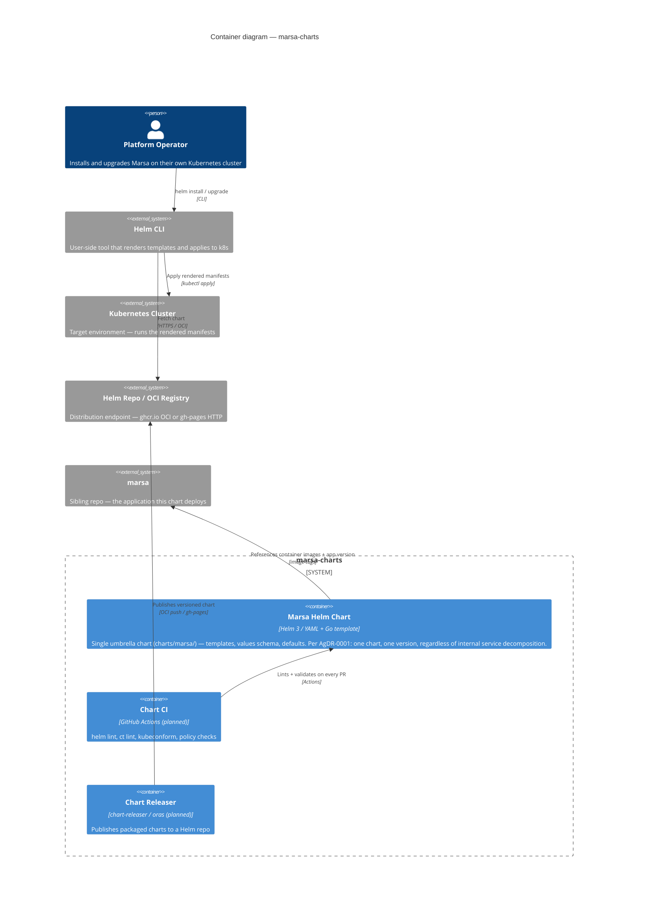

# marsa-charts — C4 Container Diagram (L2)

> **Note**: this diagram was auto-generated by /handover on 2026-05-29 from repo signals (none — repo is empty beyond initial commit). It is a **starting point** — review and refine.
>
> - Container labels and tech strings — the detector had no signals to work from; this is a hand-shaped sketch based on the repo's stated purpose ("Helm charts for Marsa").
> - Inferred relationships — assumes the standard Helm install-time flow; adjust to your actual distribution model.
> - External systems — only the obvious ones are drawn; subcharts and operator-managed infra (e.g. cert-manager, ingress controller) will need adding once chart structure is decided.
>
> Update the "Maintenance" section below once the diagram is stable.

## Maintenance

(From the template — update when L2 containers change.)
