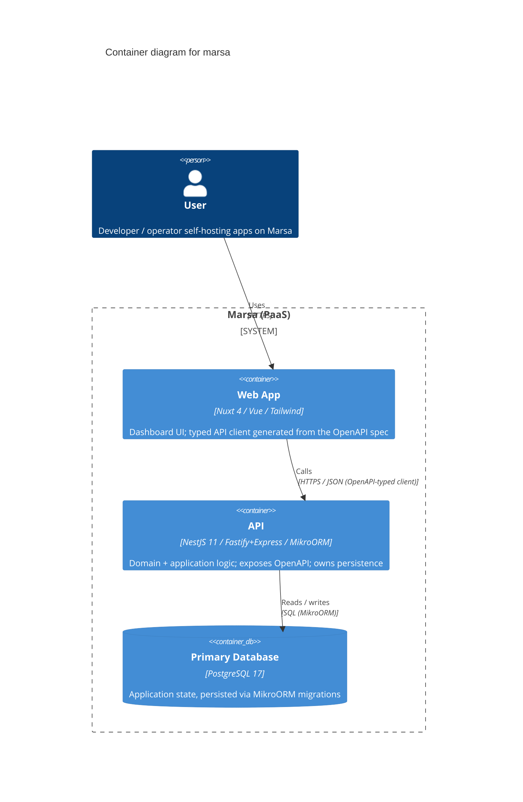

# marsa — C4 Container Diagram (L2)

> **Note**: this diagram was auto-generated by /handover on 2026-05-27 from repo signals (package.json, docker-compose.yml, pnpm-workspace.yaml, MikroORM/Nest deps). It is a **starting point** — review and refine.
>
> - Container labels and tech strings — the detector may have picked a framework version wrong (e.g. API lists both Fastify and Express platform adapters; confirm which is the deployed one).
> - Inferred relationships — `user → web` assumes HTTPS; adjust if your stack uses something else.
> - External systems — anything not in package.json won't have been detected. The Kubernetes/K3s deployment target and any future Auth provider (GitHub OAuth per issue #23) are **not** drawn here yet — add them once implemented.
>
> Update the "Maintenance" section below once the diagram is stable.

## Maintenance

(From the template — update when L2 containers change.)
