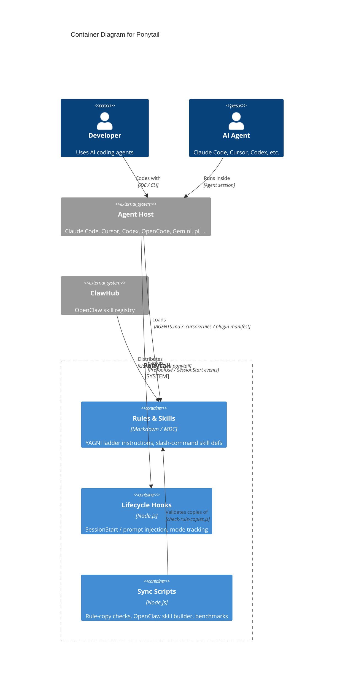

# Container Diagram — Ponytail

> **C4 Level 2** — agent harness tooling (not a deployed service).

## Diagram

> **Note**: this diagram was auto-generated by /handover on 2026-06-19 from repo signals (package.json, hooks/, skills/, agent adapter dirs). It is a **starting point** — review and refine.
>
> - Container labels and tech strings — the detector may have picked a framework version wrong
> - Inferred relationships — user → web assumes HTTPS; adjust if your stack uses something else
> - External systems — anything your team uses that isn't in package.json (e.g. infra-only dependencies, direct cloud APIs called via HTTP) won't have been detected
>
> Update the "Maintenance" section below once the diagram is stable.

## Maintenance

(From the template — update when L2 containers change.)
